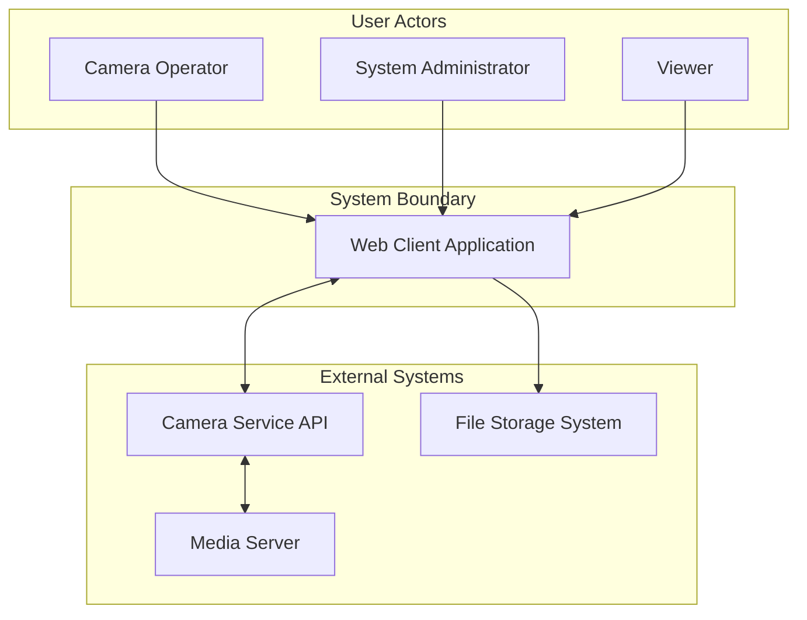
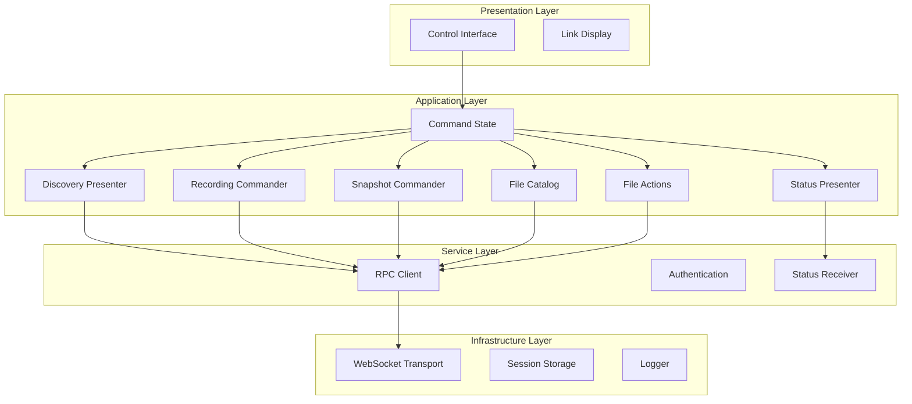
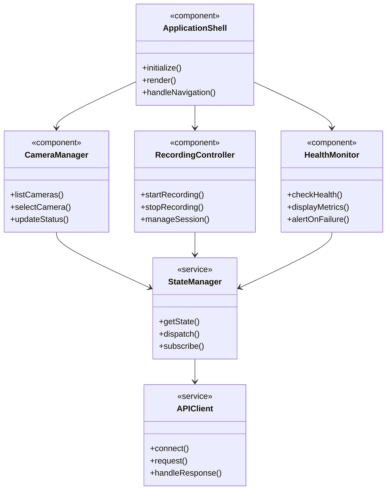
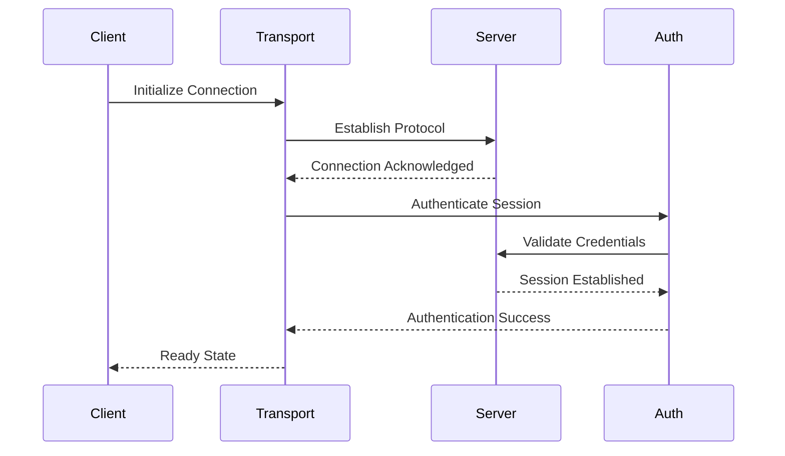
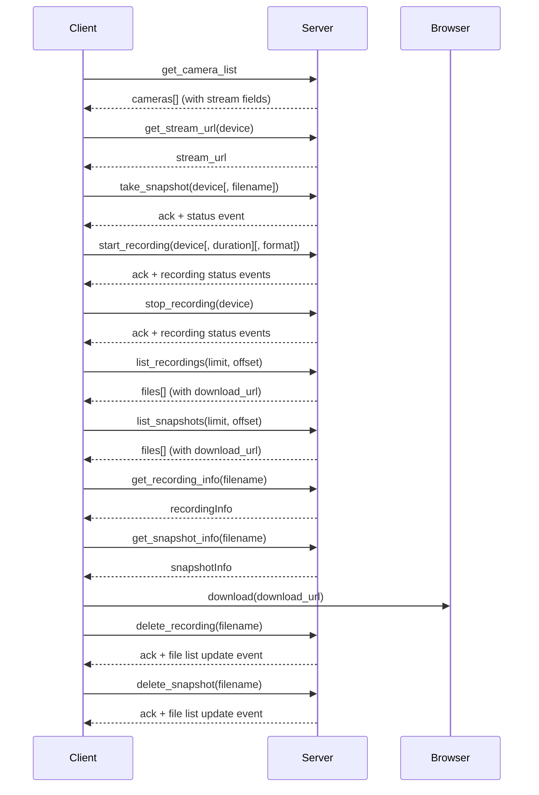
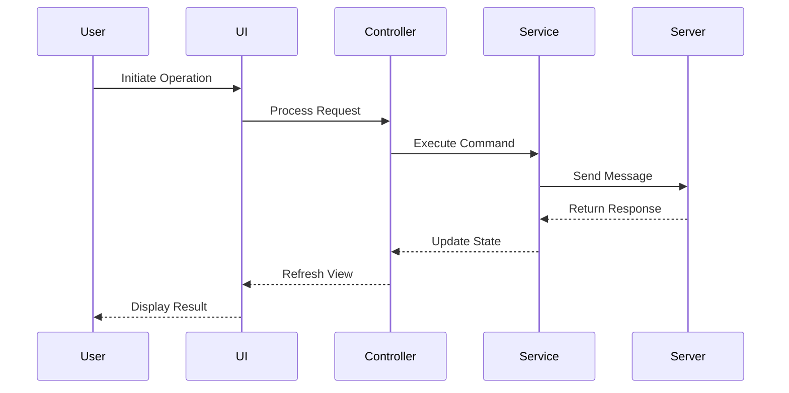
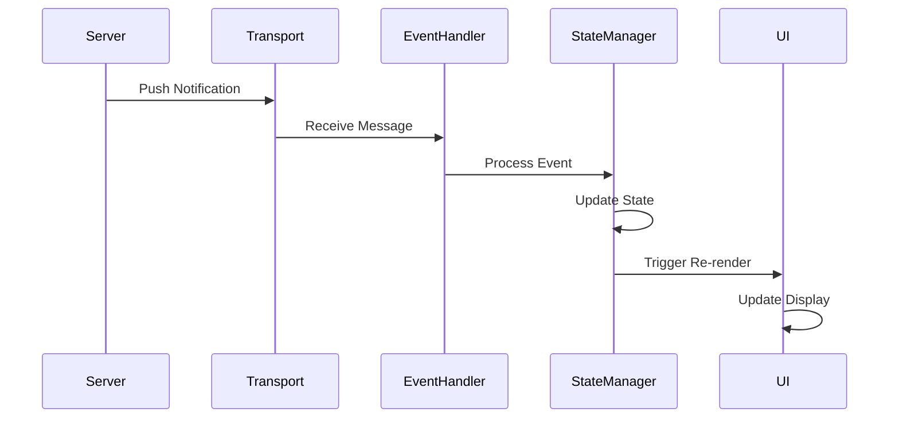
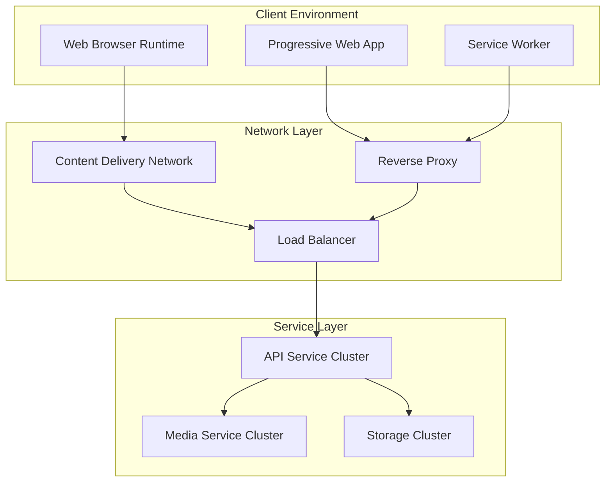
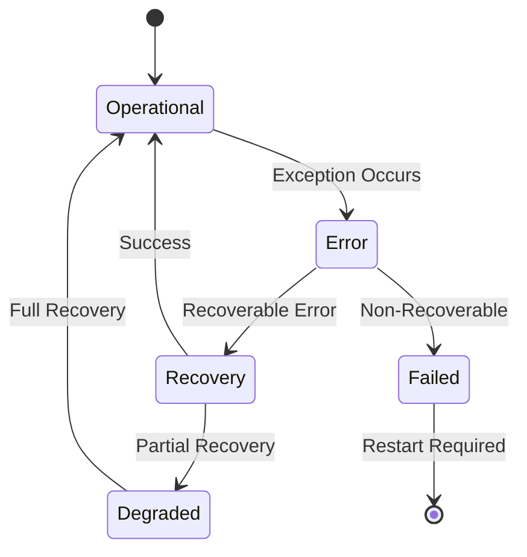
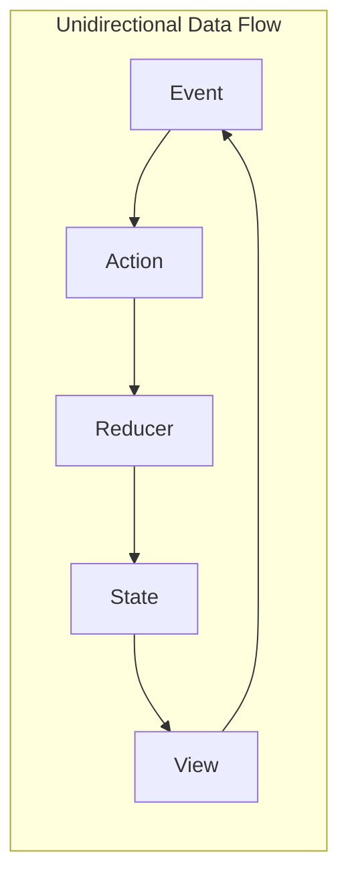

# MediaMTX Camera Service Client - Software Architecture Document

**Document Version:** 1.0  
**Date:** January 2025  
**Standards:** IEEE 42010:2011 & Arc42 v8.2  
**Classification:** Architecture Specification

---

## 1. Introduction and Goals

### 1.1 Requirements Overview

The MediaMTX Camera Service Client is a web-based Progressive Web Application that provides real-time camera management, monitoring, and control capabilities. The system serves as the user interface layer for the MediaMTX Camera Service ecosystem, enabling operators to manage video streams, capture recordings, and monitor system health through an intuitive interface.

#### 1.1.1 Functional Scope (Server Frontend)

- Discover cameras; display opaque stream links (HLS/WebRTC) for external playback
- Control operations via JSON-RPC: `take_snapshot`, `start_recording` (unlimited or timed), `stop_recording`
- Files: list recordings and snapshots (paginated), get file info, download via server-provided HTTP(S) links, delete on server
- Status: show server-reported system/storage status and subscribe to server events

#### 1.1.2 Non-Goals (Explicit)

- No embedded media playback, decoding, transcoding, or proxying
- No KLV/metadata parsing or correlation logic in the client
- No client-side media/file storage beyond browser download
- No client-side timers that alter server behavior (timers are server-authoritative)

### 1.2 Quality Goals

| Priority | Quality Attribute | Scenario |
|----------|------------------|----------|
| 1 | Reliability | System maintains stable connections with automatic recovery mechanisms |
| 2 | Performance | Real-time updates delivered within defined latency thresholds |
| 3 | Usability | Responsive design accessible across all device form factors |
| 4 | Maintainability | Modular architecture enabling independent feature development |
| 5 | Security | Token-based authentication with role-based access control |

### 1.3 Stakeholders

| Role | Concerns |
|------|----------|
| End Users | Intuitive interface, real-time control, reliable operation |
| System Operators | System monitoring, diagnostics, performance metrics |
| Developers | Clear architecture, maintainable design, consistent patterns |
| System Administrators | Deployment simplicity, configuration management, security |

---

## 2. Architecture Constraints

### 2.1 Technical Constraints

- Browser compatibility requirements for modern web standards
- WebSocket protocol for real-time bidirectional communication
- JSON-RPC 2.0 protocol for structured message exchange
- Token-based authentication for stateless session management
- Progressive Web App standards for offline capability

Additional scope constraints for the server-frontend client:

- Control plane: WebSocket + JSON-RPC 2.0 only
- Media plane: client surfaces HLS/WebRTC links for external playback (link exposure only)
- File access: client uses server-provided HTTP(S) download URLs; the client does not rewrite or re-sign URLs

### 2.4 Security Constraint (Client)

- Download links are opaque; the client must not persist or display credentials embedded in links
- Deletion actions require explicit user confirmation; role checks enforced by server

### 2.2 Organizational Constraints

- Distributed development requiring clear architectural boundaries
- Incremental delivery model with sprint-based releases
- Cross-platform compatibility requirements
- Compliance with accessibility standards

### 2.3 Conventions

- Component-based user interface architecture
- Functional programming paradigm for state management
- Event-driven communication patterns
- Responsive design principles

---

## 3. System Scope and Context

### 3.1 Business Context

### 3.2 Technical Context

| Interface | Protocol | Purpose |
|-----------|----------|---------|
| Service API | WebSocket with JSON-RPC 2.0 | Primary service communication |
| File Transfer | HTTP/HTTPS (server-provided URLs) | Media file retrieval |
| Authentication | JWT Bearer Tokens | Session management |
| Link Provisioning | HLS/WebRTC (link exposure only) | External playback hand-off |

Note: The client has no direct data-plane edge to MEDIA/STORAGE. Links may point to external hosts and are treated as opaque.

---

## 4. Solution Strategy

### 4.1 Architecture Approach

The system employs a layered architecture pattern with clear separation between presentation, application control, and infrastructure concerns. The client acts as a thin server-frontend focused on: command, catalog, link provisioning, and file actions (download/delete). Communication follows an event-driven model with centralized state management.

### 4.2 Technology Decisions

| Aspect | Decision | Rationale |
|--------|----------|-----------|
| UI Framework | Component-based reactive framework | Enables modular development and reusability |
| State Management | Centralized store pattern | Predictable state updates and debugging |
| Communication | WebSocket protocol | Real-time bidirectional communication |
| Build System | Module bundler with hot reload | Optimized development workflow |
| Type System | Static type checking | Enhanced code quality and maintainability |

---

## 5. Building Block View

### 5.1 System Decomposition

### 5.2 Component Structure

### 5.3 Component Interfaces (Control/Files/Status)

- I.Discovery: list devices and stream links (`get_camera_list`, `get_streams`, `get_stream_url`)
- I.Command: `take_snapshot`; `start_recording` (optional `duration`); `stop_recording`
- I.FileCatalog: `list_recordings`; `list_snapshots`; `get_recording_info`; `get_snapshot_info` (pagination)
- I.FileActions: download(url) hand-off; `delete_recording`(filename); `delete_snapshot`(filename)
- I.Status: `get_status`; `get_storage_info`; `get_server_info`; `subscribe_events` / `unsubscribe_events`; `get_subscription_stats`

#### 5.3.1 RPC Method Alignment (Authoritative)

- Discovery
  - `get_camera_list` → cameras with stream fields
  - `get_streams` → MediaMTX active streams
  - `get_stream_url` → URL for specific device
- Commands
  - `take_snapshot`(device[, filename])
  - `start_recording`(device[, duration][, format])
  - `stop_recording`(device)
- Files
  - `list_recordings`(limit, offset)
  - `list_snapshots`(limit, offset)
  - `get_recording_info`(filename)
  - `get_snapshot_info`(filename)
  - `delete_recording`(filename)
  - `delete_snapshot`(filename)
- Status / Admin
  - `get_status`, `get_storage_info`, `get_server_info`, `get_metrics`
  - `subscribe_events`, `unsubscribe_events`, `get_subscription_stats`

---

## 6. Runtime View

### 6.1 Connection Establishment

### 6.4 Control & File Operations (Client as Server Frontend)

### 6.2 Camera Operation Flow

### 6.3 Real-time Notification Flow

---

## 7. Deployment View

### 7.1 Infrastructure Architecture

### 7.2 Deployment Configuration

| Environment | Configuration |
|-------------|---------------|
| Development | Local development server with hot module replacement |
| Staging | Containerized deployment with test services |
| Production | Distributed CDN with load-balanced services |

Client connections are limited to the control API (WebSocket). Media streaming and file download links may point to external hosts and are handled outside of the client.

---

## 8. Cross-Cutting Concepts

### 8.1 Error Handling

### 8.2 State Management Pattern

### 8.3 Security Architecture

| Layer | Mechanism |
|-------|-----------|
| Authentication | Token-based authentication with refresh mechanism |
| Authorization | Role-based access control with permission matrix |
| Transport | Encrypted communication channels |
| Input Validation | Client and server-side validation |
| Session Management | Automatic timeout and renewal |

---

## 9. Architecture Decisions

### 9.1 ADR-001: Communication Protocol

**Status:** Accepted

**Context:** Need for real-time bidirectional communication

**Decision:** WebSocket with JSON-RPC 2.0 protocol

**Consequences:** Persistent connection requirement, structured message format, automatic reconnection handling required

### 9.2 ADR-002: State Management

**Status:** Accepted

**Context:** Requirement for predictable state updates across components

**Decision:** Centralized state store with unidirectional data flow

**Consequences:** Single source of truth, predictable updates, potential performance considerations for large state trees

### 9.3 ADR-003: Component Architecture

**Status:** Accepted

**Context:** Need for reusable and maintainable UI components

**Decision:** Atomic design pattern with hierarchical component structure

**Consequences:** Consistent UI patterns, clear component boundaries, initial development overhead

---

### 9.4 ADR-004: No Embedded Playback

**Status:** Accepted

**Context:** Prevent scope creep and media-plane responsibilities on the client

**Decision:** The client displays opaque HLS/WebRTC links for external playback and does not embed a player

**Consequences:** Clear separation of concerns, reduced complexity, easier security posture

### 9.5 ADR-005: Server-Authoritative Timers

**Status:** Accepted

**Context:** Recording durations and timing must be reliable and auditable

**Decision:** Recording timers are managed by the server; the client issues intent with optional duration

**Consequences:** Deterministic behavior, simpler client, consistent audit trail

### 9.6 ADR-006: File Operations Limited to Server-Side

**Status:** Accepted

**Context:** Ensure the client does not take on storage/media responsibilities

**Decision:** Client lists/downloads/deletes files via server APIs and server-provided URLs; no local copies beyond browser download

**Consequences:** Simplified client and consistent server-controlled file lifecycle

## 10. Quality Requirements

### 10.1 Performance Requirements

| Metric | Target | Measurement Method |
|--------|--------|-------------------|
| Initial Load Time | < 3 seconds | Performance monitoring |
| Time to Interactive | < 5 seconds | User timing API |
| Command Ack | ≤ 200ms (p95) | WebSocket round-trip |
| Event-to-UI | ≤ 100ms (p95) | Notification to render |

### 10.2 Reliability Requirements

| Aspect | Requirement |
|--------|------------|
| Availability | 99.9% uptime during operational hours |
| Recovery Time | Automatic recovery within 30 seconds |
| Data Integrity | Zero data loss during normal operations |
| Error Rate | Less than 0.1% transaction failure rate |

### 10.3 Usability Requirements

| Aspect | Requirement |
|--------|------------|
| Accessibility | WCAG 2.1 Level AA compliance |
| Responsiveness | Support for viewports from 320px to 4K |
| Browser Support | Latest two versions of major browsers |
| Localization | Support for internationalization framework |

---

## 11. Risks and Technical Debt

### 11.1 Risk Assessment

| Risk | Probability | Impact | Mitigation Strategy |
|------|------------|--------|-------------------|
| Connection Instability | Medium | High | Implement robust reconnection logic |
| State Synchronization | Medium | Medium | Clear state recovery procedures |
| Performance Degradation | Low | High | Performance monitoring and optimization |
| Security Vulnerabilities | Low | Critical | Regular security audits and updates |

### 11.2 Technical Debt Management

| Category | Strategy |
|----------|----------|
| Code Quality | Regular refactoring cycles |
| Documentation | Continuous documentation updates |
| Testing | Maintain test coverage targets |
| Dependencies | Regular dependency updates |

---

## 12. Glossary

| Term | Definition |
|------|------------|
| PWA | Progressive Web Application - web application with native-like capabilities |
| WebSocket | Full-duplex communication protocol over TCP |
| JSON-RPC | Remote procedure call protocol using JSON |
| JWT | JSON Web Token - compact means of representing claims |
| CDN | Content Delivery Network - distributed content serving |
| HLS | HTTP Live Streaming - adaptive bitrate streaming protocol |
| WebRTC | Web Real-Time Communication - peer-to-peer communication |

---

## 13. Architecture Compliance Checklist

### IEEE 42010 Compliance
- ☑ Architecture description identifies stakeholders
- ☑ Architecture description identifies concerns
- ☑ Architecture viewpoints are specified
- ☑ Architecture views address concerns
- ☑ Architecture views are consistent
- ☑ Architecture rationale is documented

### Arc42 Compliance
- ☑ Introduction and goals documented
- ☑ Constraints identified
- ☑ Context and scope defined
- ☑ Solution strategy described
- ☑ Building blocks detailed
- ☑ Runtime view illustrated
- ☑ Deployment view specified
- ☑ Cross-cutting concepts explained
- ☑ Architecture decisions recorded
- ☑ Quality requirements defined
- ☑ Risks and technical debt assessed
- ☑ Glossary provided

---

### 13.4 Scope Compliance (Server Frontend)

- ☑ Client does not embed or proxy media; exposes HLS/WebRTC links only
- ☑ Client supports snapshot and recording (start/stop/timed)
- ☑ Client supports file list, download via server-provided URLs, and delete
- ☑ Control plane limited to WebSocket/JSON-RPC; no protocol expansion
- ☑ Delete actions require confirmation; URLs treated as opaque; no tokens logged

**Document Status:** Released  
**Classification:** Architecture Specification  
**Review Cycle:** Quarterly  
**Approval:** Architecture Board