# MediaMTX Camera Service

A distributed video sensor management service designed for OCI-compliant container environments. This service provides real-time video source discovery, streaming, recording, and management capabilities as part of a larger multi-sensor ecosystem with centralized service discovery. It will allow users to take snapshots and record videos from USB-V4L2 devices and STANAG 4609 UAV streams from external UAVs connected to the container.

## System Overview

The MediaMTX Camera Service is an always-on containerized service that manages both USB video devices and external RTSP feeds within a coordinated sensor ecosystem. It operates as a specialized video sensor container that registers with a central service discovery aggregator and provides standardized video services to client applications.

**Version:** 3.3  
**Date:** 2025-09-12  
**Status:** Production Architecture Documentation  
**Document Type:** System Architecture Specification

---

## 1. System Context

### 1.1 System Boundaries

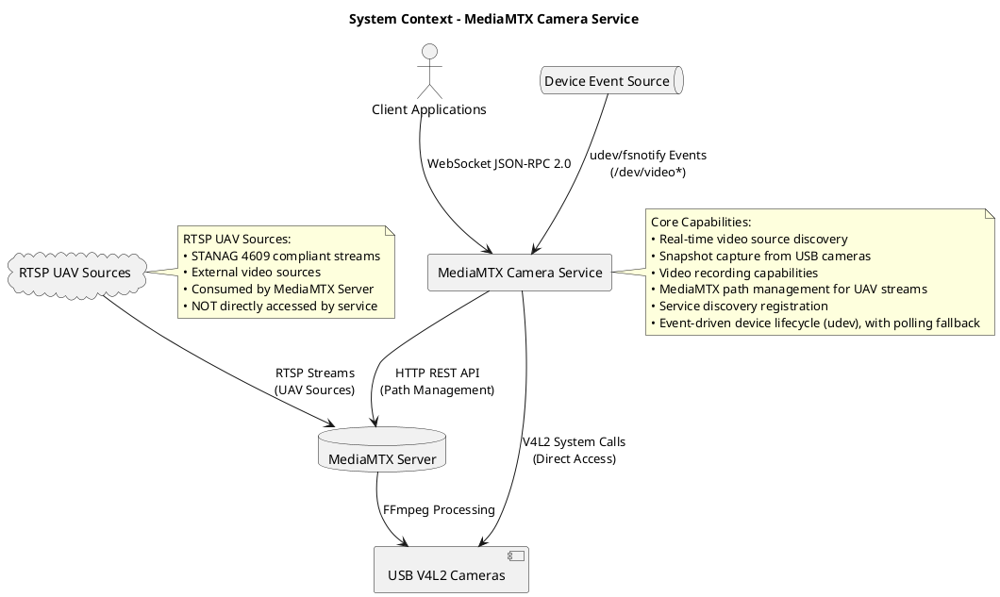

### 1.2 Quality Attributes

| Attribute | Target | Measurement |
|-----------|--------|-------------|
| **Performance** | <100ms response time | 95th percentile API calls |
| **Concurrency** | 1000+ connections | Simultaneous WebSocket clients |
| **Availability** | 99.9% uptime | System operational time |
| **Reliability** | <0.1% error rate | Failed operations ratio |

---

## 2. External Interface Architecture

### 2.1 Exposed Interfaces (Inbound)

**JSON-RPC 2.0 API (Primary External Interface)**
- **Protocol:** WebSocket over TCP
- **Port:** 8002
- **Documentation:** `docs/api/json_rpc_methods.md`
- **Authentication:** JWT Bearer tokens
- **Clients:** Web browsers, mobile apps, desktop applications

**Recording Architecture Notes:**
- **Path Reuse:** Single MediaMTX path ("camera0") handles both streaming AND recording simultaneously
- **File Management:** Recording filenames are independent of path names (configured via recordPath)
- **Pattern Support:** MediaMTX handles timestamp patterns in filenames (e.g., camera0_%Y-%m-%d_%H-%M-%S.mp4)

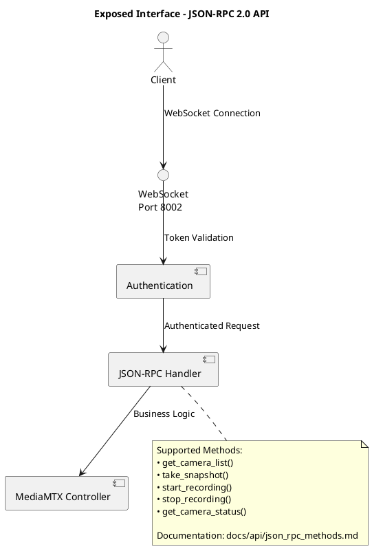

### 2.2 Consumed Interfaces (Outbound)

**MediaMTX REST API (External Dependency)**
- **Protocol:** HTTP/1.1
- **Endpoint:** http://localhost:9997/v3/
- **Purpose:** Stream path management, configuration
- **Required Version:** MediaMTX v1.0+

**V4L2 Hardware Interface**
- **Protocol:** Linux system calls
- **Devices:** /dev/video* character devices
- **Purpose:** Direct camera hardware access

**Linux Device Event Source**
- **Primary:** udev (netlink; add/remove/change)
- **Fallback:** fsnotify on `/dev` for `/dev/video*`
- **Purpose:** Push-based propagation of device lifecycle (no index polling)

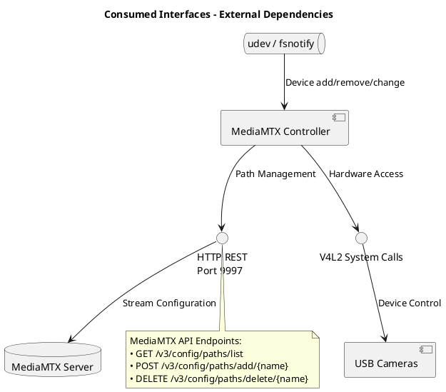

---

## 3. Internal Component Architecture

### 3.1 Component Structure

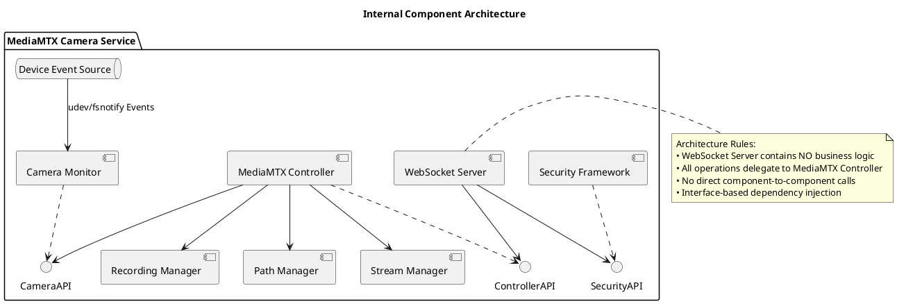

### 3.2 Component Responsibilities

**WebSocket Server (Protocol Layer)**
- JSON-RPC 2.0 protocol implementation
- WebSocket connection management (1000+ concurrent)
- Authentication enforcement
- **Constraint:** NO business logic - delegates all operations

**MediaMTX Controller (Business Logic Layer)**
- Camera operations coordination
- Stream lifecycle management
- API abstraction (camera0 ↔ /dev/video0)
- Recording orchestration (delegate to RecordingManager)
- Path reuse optimization
- **Mapping Rule:** External identifiers (`camera0`) map to **discovered devices only**; no synthetic indices
- **Pattern:** Single Source of Truth for all operations

**Recording Manager (Sub-component of MediaMTX Controller)**
- Recording state management via MediaMTX API
- Path configuration via PATCH operations
- Auto-stop timer management
- RTSP keepalive coordination
- **Key Insight:** Uses same MediaMTX path for streaming and recording
- **Pattern:** Stateless recording - query MediaMTX for status
- **Sequence (hard invariant):** PATCH record flag → Start RTSP keepalive → Set timer (if duration specified)

**Camera Monitor (Hardware Abstraction Layer)**
- **Mode:** Event-first, Polling-fallback
- **Device Discovery:** udev/fsnotify events (add/remove/change)
- **Polling Fallback:** Slow periodic reconcile when events unavailable
- **State Store:** Authoritative device map (`/dev/video*` → metadata)
- **Responsibilities:**
  1. Emit debounced add/remove to Controller
  2. Validate device readiness (optional capability probe)
  3. Never guess indices (no `[0-9]` scans); real paths only
  4. Provide lookups for abstraction mapping (cameraX ↔ /dev/videoN)
- **Integration:** Interface-based design with dependency injection

**Path Manager (Configuration & Activation)**
- **Contract:** Create → **Skip readiness check for on-demand paths** → Patch (retry)
- **Idempotent Create:** Config add if missing; "already exists" = success
- **On-Demand Paths:** Skip readiness checks - paths activate when accessed, not when created
- **Patch Resilience:** Exponential backoff on 404/409; include path/device context in errors
- **Per-Path Mutex:** Serialize operations for a path across callers
- **Map Parameter Contract:** All `map[string]interface{}` params are optional; `nil` means "no options". PathManager never mutates caller-supplied maps.

**Security Framework (Cross-Cutting Layer)**
- JWT token management
- Role-based access control (viewer/operator/admin)
- Session management
- **Pattern:** Middleware integration with existing configuration

### 3.3 Optional Components Pattern

Some components are optional based on configuration and may be nil:

| Component | Required | Initialization Condition |
|-----------|----------|-------------------------|
| cameraMonitor | ✅ Yes | Always initialized |
| healthMonitor | ✅ Yes | Always initialized |
| recordingManager | ✅ Yes | Always initialized |
| externalDiscovery | ❌ No | Only if external streams enabled |
| pathIntegration | ❌ No | Only if auto-path creation enabled |

**Pattern Rules:**
1. Optional components may be nil
2. ALL methods MUST check for nil before use
3. Return graceful errors or empty results for nil components
4. Document optional nature in constructor

**Implementation Pattern:**
```go
// Helper methods for consistent checking
func (c *controller) hasExternalDiscovery() bool {
    return c.externalDiscovery != nil
}

// All methods must check before use
func (c *controller) RemoveExternalStream(ctx context.Context, streamURL string) error {
    if !c.hasExternalDiscovery() {
        return fmt.Errorf("external stream discovery is not configured")
    }
    // Safe to use c.externalDiscovery
}
```

**MediaMTX Controller - SINGLE SOURCE OF TRUTH**

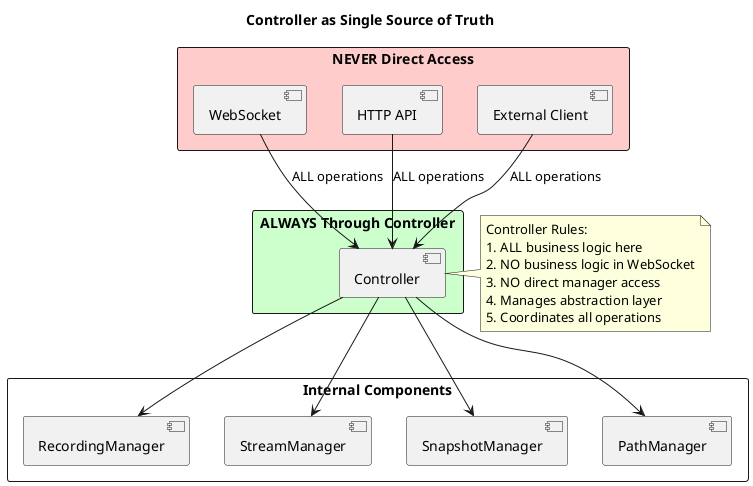

### 3.3 Internal Interface Contracts

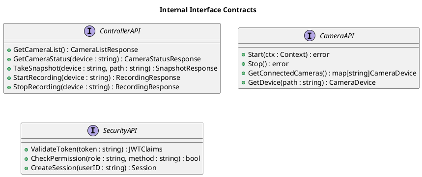

### 3.4 Configuration Integration Pattern

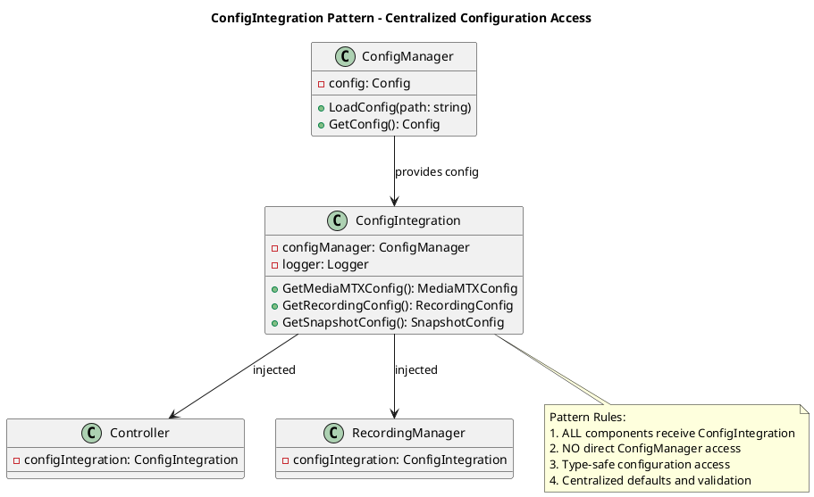

**Developer Note:** Every manager component MUST receive ConfigIntegration in its constructor

### 3.5 Abstraction Layer Architecture

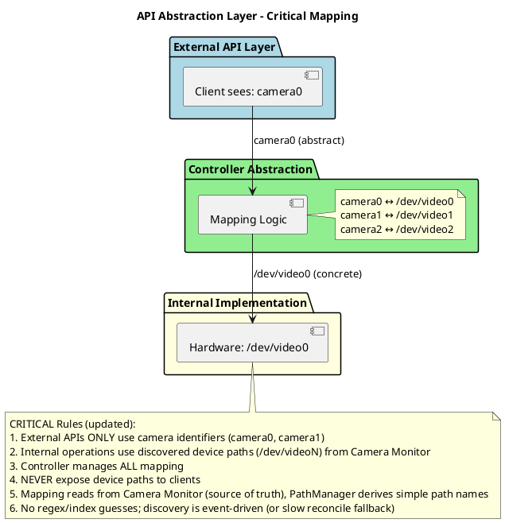

### 3.6 Component Dependency Hierarchy

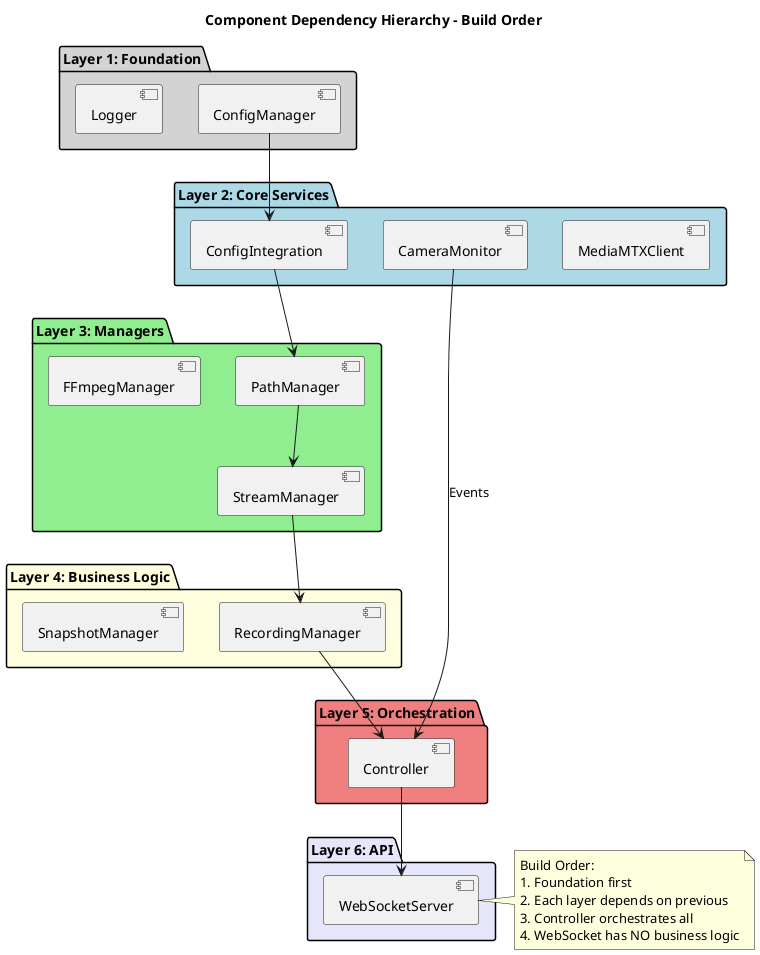

---

## 4. Process Architecture

### 4.1 Authentication Flow

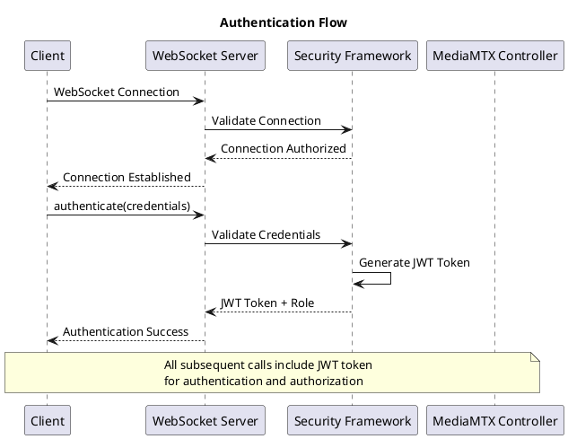

### 4.2 Multi-Tier Snapshot Architecture

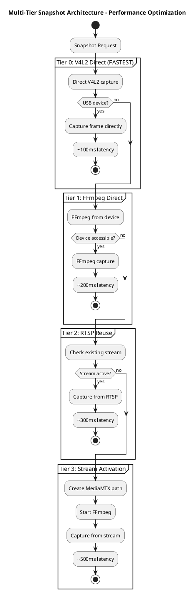

**Performance Targets:**
- Tier 0: <100ms (USB only)
- Tier 1: <200ms (direct capture)
- Tier 2: <300ms (stream reuse)
- Tier 3: <500ms (stream creation)

### 4.2.1 Device Event Flow

```plantuml
@startuml DeviceEventFlow
title Device Event Flow - udev/fsnotify with Polling Fallback

queue "Device Event Source\n(udev/fsnotify)" as E
component "Camera Monitor" as M
component "MediaMTX Controller" as C
database "Device Map" as DM

E --> M : add/remove/change(/dev/videoN)
M -> DM : update state (debounced)
M --> C : OnChange(camera list delta)
C -> C : cameraX ↔ /dev/videoN mapping updates

== Fallback ==
M -> M : Periodic reconcile (slow) if events unavailable
M -> DM : correct drift
M --> C : delta if changed

note right of M
Rules:
• Event-first architecture
• Poll only as safety net
• No index guessing (regex)
end note

@enduml
```

### 4.3 System Startup Coordination

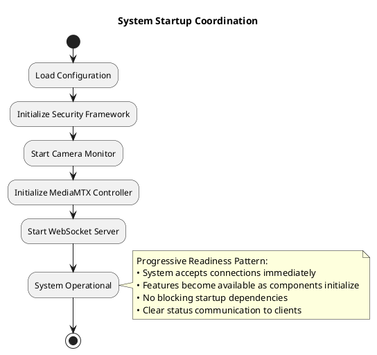

### 4.4 Recording Flow

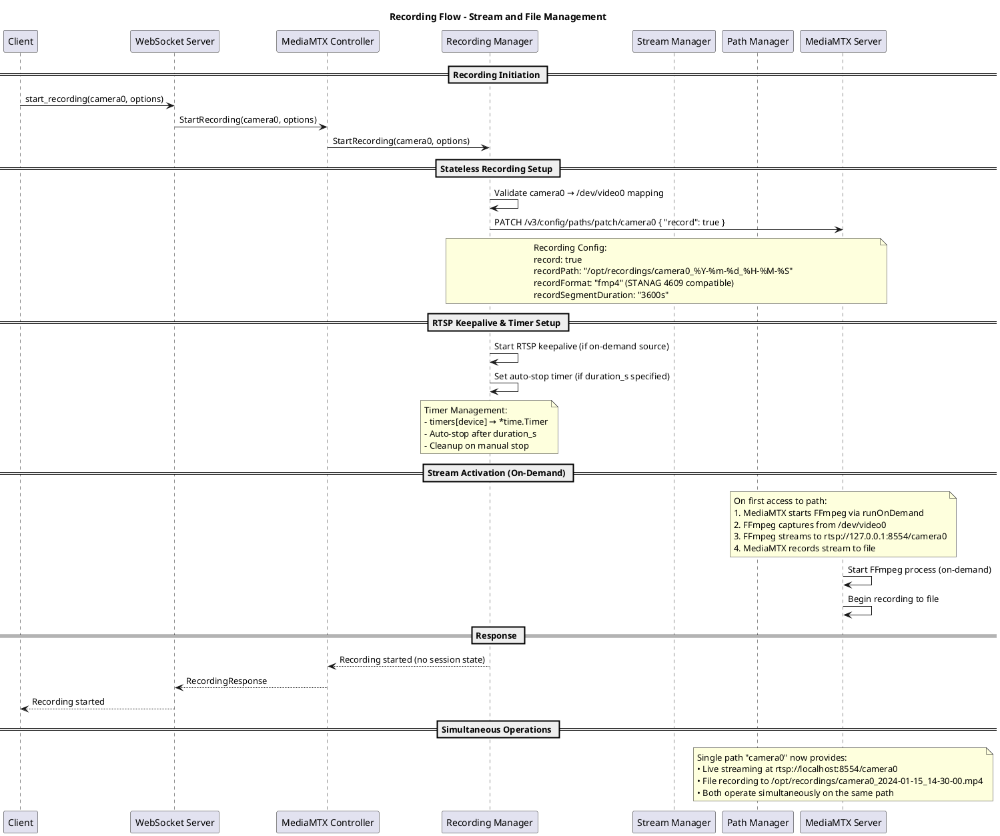

### 4.5 Path Management Architecture

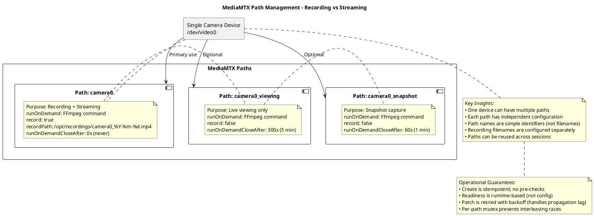

### 4.6 On-Demand FFmpeg Process Management

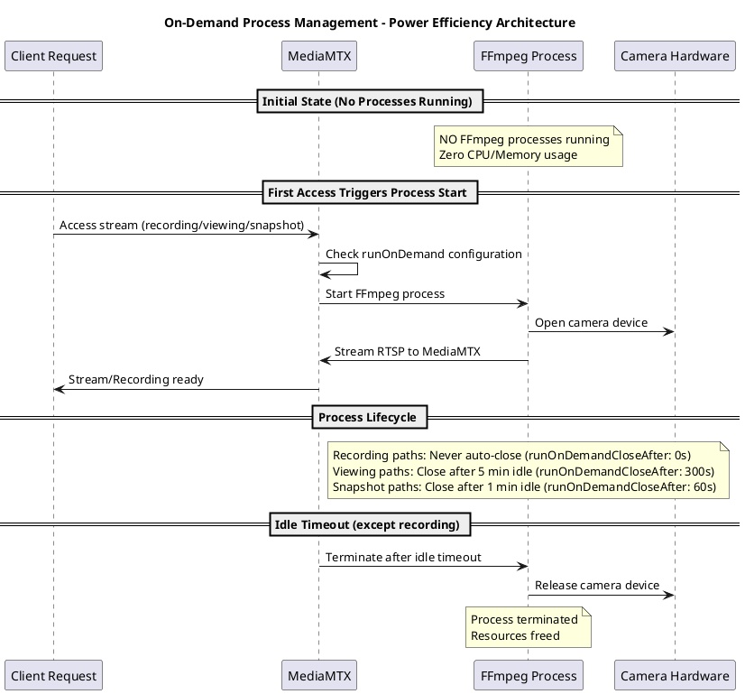

**CRITICAL UNDERSTANDING:**
- **FFmpeg processes are NOT always running** - they start on-demand
- **Zero resource usage when idle** - no CPU/memory consumption
- **Automatic cleanup** - processes terminate after configured idle time
- **Recording exception** - recording processes never auto-terminate

### 4.7 FFmpeg Stream Direction Clarification

```plantuml
@startuml FFmpegDirection
title FFmpeg Stream Direction - Critical Understanding

component "Camera\n/dev/video0" as CAM
component "FFmpeg Process" as FF
component "MediaMTX Server" as MTX
database "Recording File\ncamera0_2024.mp4" as FILE
component "RTSP Clients" as CLIENTS

CAM --> FF: Raw video frames
FF --> MTX: RTSP stream\nrtsp://127.0.0.1:8554/camera0
MTX --> FILE: Records stream to file
MTX --> CLIENTS: Distributes stream

note over FF
FFmpeg does NOT write to file!
FFmpeg ONLY streams to MediaMTX
MediaMTX handles file writing
end note

note bottom of MTX
MediaMTX Responsibilities:
1. Receives RTSP from FFmpeg
2. Records to file (if record=true)
3. Distributes to clients
4. Handles file rotation
5. Manages segmentation
end note

@enduml
```

### 4.8 Stateless Recording Architecture

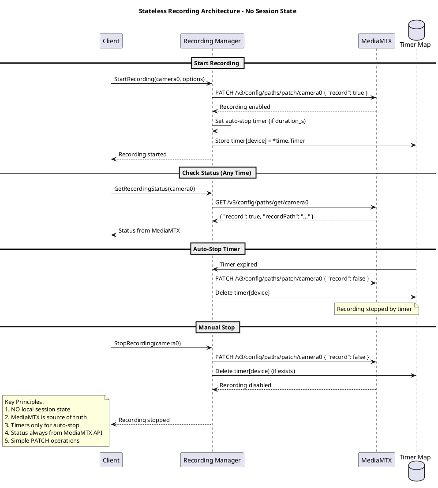

### 4.9 Path Lifecycle Management

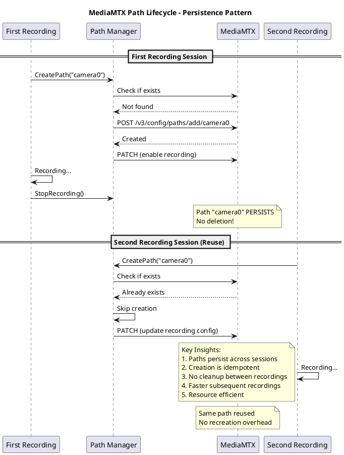

---

## 5. Physical Architecture

### 5.1 Deployment Architecture

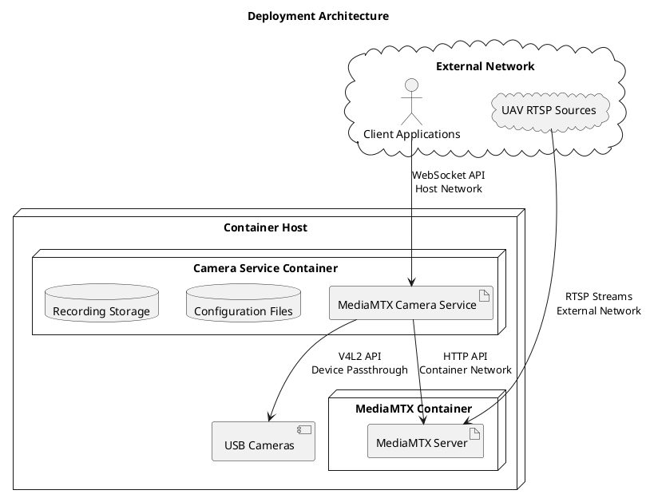

### 5.3 Container Deployment Strategy

**Option 1: Separate Containers**
- **Advantages:**
  - Independent scaling of MediaMTX and camera service
  - Separate lifecycle management and updates
  - Better resource isolation and fault isolation
  - Follows microservices architecture principles

**Option 2: Single Container (Recommended)**
- **Advantages:**
  - Simpler deployment and management
  - Faster inter-process communication
  - Shared resource utilization
  - Reduced network overhead

**Recommendation:** Separate containers for production deployments enable independent scaling and lifecycle management. Single container acceptable for development or resource-constrained environments. DTS is closer to the second use.

### 5.2 Network Architecture

| Port | Protocol | Purpose | Security |
|------|----------|---------|----------|
| 8002 | WebSocket | Client API | JWT Authentication |
| 8003 | HTTP | Health checks | Internal only |
| 9997 | HTTP | MediaMTX API | Internal only |
| 8554 | RTSP | Media streaming | Internal only |

---

## 6. Data Architecture

### 6.1 Core Data Models

```plantuml
@startuml DataModels
title Core Data Models

class CameraDevice {
    +Path : string
    +Name : string
    +Status : string
    +Capabilities : V4L2Capabilities
    +LastSeen : time
    +Error : error
}

class V4L2Capabilities {
    +DriverName : string
    +CardName : string
    +BusInfo : string
    +Version : string
    +Capabilities : array
    +DeviceCaps : array
}

class Session {
    +ID : string
    +UserID : string
    +Role : string
    +Created : time
    +LastActivity : time
    +IsActive : bool
}

class SnapshotResult {
    +Device : string
    +FilePath : string
    +Size : int64
    +Created : time
    +TierUsed : int
    +CaptureTime : float64
}

class RecordingTimer {
    +Device : string  // Camera identifier (e.g., "camera0")
    +Duration : time.Duration
    +StartTime : time
    +AutoStop : bool
}

class MediaMTXPath {
    +Name : string  // Simple identifier (e.g., "camera0")
    +RunOnDemand : string  // FFmpeg command
    +Record : bool  // Recording enabled
    +RecordPath : string  // File pattern with timestamps
    +RecordFormat : string  // fmp4 for STANAG 4609
    +RuntimeVisible : bool  // updated by readiness checks
}

CameraDevice *-- V4L2Capabilities
Session ||--o{ SnapshotResult
RecordingTimer *-- MediaMTXPath

note right of RecordingTimer
Stateless Recording:
- No session state stored locally
- Recording status from MediaMTX API
- Timer only for auto-stop functionality
- Path name ("camera0") is NOT the filename
end note

@enduml
```

### 6.2 Configuration Schema

```plantuml
@startuml ConfigurationSchema
title Configuration Schema

class Config {
    +ServerConfig Server
    +CameraConfig Camera
    +MediaMTXConfig MediaMTX
    +SecurityConfig Security
    +LoggingConfig Logging
}

class ServerConfig {
    +string Host
    +int Port
    +string WebSocketPath
    +int MaxConnections
}

class SecurityConfig {
    +string JWTSecretKey
    +int JWTExpiryHours
    +int RateLimitRequests
    +string RateLimitWindow
}

class CameraConfig {
    +float64 PollInterval
    +[]int DeviceRange
    +float64 DetectionTimeout
    +bool EnableCapabilityDetection
}

Config *-- ServerConfig
Config *-- SecurityConfig
Config *-- CameraConfig

@enduml
```

---

## 7. Security Architecture

### 7.1 Security Model

```plantuml
@startuml SecurityModel
title Security Architecture

rectangle "Security Layers" {
    (Network Security) --> (Authentication)
    (Authentication) --> (Authorization)
    (Authorization) --> (Input Validation)
    (Input Validation) --> (Audit Logging)
}

rectangle "Authentication Components" {
    (JWT Tokens) --> (Session Management)
    (Session Management) --> (Role Assignment)
}

rectangle "Authorization Components" {
    (Permission Matrix) --> (Method-Level RBAC)
    (Method-Level RBAC) --> (Resource Access Control)
}

@enduml
```

### 7.2 Role-Based Access Control

| Role | Permissions | Use Case |
|------|-------------|----------|
| **viewer** | Read-only access to status and listings | Monitoring dashboards |
| **operator** | Camera control + viewer permissions | Day-to-day operations |
| **admin** | Full system access + metrics | System administration |

### 7.3 Security Implementation

```plantuml
@startuml SecurityImplementation
title Security Implementation Flow

start

:Client Request;
:Rate Limiting Check;

if (Rate Limit Exceeded?) then (yes)
    :Return Rate Limit Error;
    stop
else (no)
    :JWT Token Validation;
endif

if (Token Valid?) then (yes)
    :Extract Role from Token;
    :Check Method Permissions;
    
    if (Permission Granted?) then (yes)
        :Execute Method;
        :Log Success Event;
        :Return Response;
    else (no)
        :Log Authorization Failure;
        :Return Authorization Error;
    endif
else (no)
    :Log Authentication Failure;
    :Return Authentication Error;
endif

stop

@enduml
```

---

## 8. Video Source Architecture Strategy

### 8.1 Source Type Comparison Matrix

| **Aspect** | **Local V4L2 Sources** | **External RTSP Sources** |
|------------|------------------------|---------------------------|
| **Source Identification** | `/dev/video0`, `/dev/video1` | `rtsp://192.168.42.10:5554/subject` |
| **Camera ID Mapping** | `camera0` ↔ `/dev/video0` | `camera0` ↔ `rtsp://192.168.42.10:5554/subject` |
| **MediaMTX Path Creation** | `RunOnDemand` = FFmpeg command | `Source` = RTSP URL directly |
| **On-Demand Behavior** | ✅ FFmpeg starts when client connects | ✅ RTSP proxy starts when client connects |
| **Recording Activation** | Requires RTSP keepalive for immediate start | Requires RTSP keepalive for immediate start |
| **Path Configuration** | `opts.RunOnDemand = ffmpegCommand` | `pathConfig.Source = rtspURL` |
| **MediaMTX Process** | Starts FFmpeg subprocess | Starts RTSP proxy/relay |
| **Resource Usage** | FFmpeg process per active path | RTSP proxy per active path |
| **Streaming Operations** | FFmpeg transcodes V4L2 → RTSP | MediaMTX relays RTSP → RTSP |
| **Snapshot Operations** | Multi-tier: V4L2 direct → FFmpeg → RTSP | RTSP capture only |
| **Hardware Dependencies** | USB device availability | Network connectivity |
| **Failure Modes** | Device disconnection, driver issues | Network timeouts, stream unavailable |
| **Keepalive Purpose** | Triggers on-demand FFmpeg startup | Triggers on-demand RTSP proxy startup |
| **Process Lifecycle** | Starts/stops with client demand | Starts/stops with client demand |
| **CPU Impact** | Higher (video transcoding) | Lower (stream relaying) |
| **Network Impact** | Local (USB → MediaMTX) | Higher (external → MediaMTX) |
| **STANAG 4609 Support** | Via MediaMTX fmp4 recording | Native RTSP stream compliance |

### 8.2 Universal On-Demand Architecture

```plantuml
@startuml UniversalOnDemand
title Universal On-Demand Process Architecture

participant "Operation Request" as req
participant "MediaMTX Path" as path
participant "RTSP Keepalive" as keep
participant "Process (FFmpeg/Relay)" as proc
participant "Video Source" as source

== Streaming Operation ==
req -> path : Configure for streaming
req -> keep : Client RTSP connection
keep -> path : Trigger runOnDemand
path -> proc : Start FFmpeg/relay
proc -> source : Begin capture/relay
source -> proc : Video data
proc -> path : RTSP stream
path -> req : Stream available

== Recording Operation ==
req -> path : Configure for recording + streaming
req -> keep : Service keepalive connection
keep -> path : Trigger runOnDemand
path -> proc : Start FFmpeg/relay
proc -> source : Begin capture/relay
source -> proc : Video data
proc -> path : RTSP stream
path -> path : Record stream to file
path -> req : Recording active

== Snapshot Operation ==
req -> path : Configure for temporary streaming
req -> keep : Temporary RTSP connection
keep -> path : Trigger runOnDemand
path -> proc : Start FFmpeg/relay
proc -> source : Capture single frame
source -> proc : Frame data
proc -> path : RTSP stream
path -> req : Frame available
req -> keep : Cleanup connection
keep -> path : Stop if idle

note right of keep
  RTSP Keepalive Critical:
  • Required for both V4L2 and RTSP
  • Enables immediate activation
  • Maintains process during ops
  • Automatic cleanup on idle
end note
@enduml
```

---

## 9. Quality Attributes

### 9.1 Performance Architecture

**Response Time Optimization:**
- **Tier 0 Snapshots:** Direct V4L2 access (<200ms)
- **Connection Pooling:** Reuse MediaMTX connections
- **Event System:** O(log n) client notification scaling
- **Memory Management:** Object pooling for high-frequency operations

**Concurrency Design:**
- **Goroutine-Based:** Non-blocking concurrent operations
- **Channel Communication:** Lock-free inter-component communication
- **Context Cancellation:** Graceful operation termination
- **Resource Limiting:** Bounded goroutine pools

### 9.2 Reliability Architecture

**Fault Tolerance:**
- **Multi-Tier Fallback:** Snapshot capture tier degradation
- **Circuit Breaker:** MediaMTX communication protection
- **Health Monitoring:** Component status tracking
- **Graceful Degradation:** Partial functionality under failure

**Error Handling:**
- **Structured Errors:** Consistent error response format
- **Error Propagation:** Clean error context preservation
- **Recovery Mechanisms:** Automatic retry with exponential backoff (PATCH), per-path serialization
- **Failure Isolation:** Component failures don't cascade

#### Circuit Breaker Implementation

```plantuml
@startuml CircuitBreaker
title Circuit Breaker Pattern - MediaMTX Communication

state "Closed\n(Normal)" as Closed
state "Open\n(Failing)" as Open
state "Half-Open\n(Testing)" as HalfOpen

Closed --> Open : Failure threshold reached\n(5 failures in 10s)
Open --> HalfOpen : After timeout\n(30 seconds)
HalfOpen --> Closed : Test succeeds
HalfOpen --> Open : Test fails

note right of Open
When Open:
- Fail fast (no MediaMTX calls)
- Return cached data if available
- Log circuit breaker state
- Alert monitoring system
end note

note bottom of HalfOpen
Half-Open Testing:
- Allow one test request
- If success, close circuit
- If failure, reopen circuit
- Exponential backoff on reopens
end note

@enduml
```

### 9.3 Scalability Architecture

**Horizontal Scaling Readiness:**
- **Stateless Design:** Session state externalization capability; device map can be externalized if clustered
- **Resource Separation:** Compute vs storage separation
- **Event Distribution:** External event system integration ready
- **Service Discovery:** Container orchestration compatibility

---

## 10. Design Principles

### 10.1 Architectural Principles Applied

**Path Reuse Principle:**
- MediaMTX paths are reusable resources, not per-session entities
- One path can handle multiple functions (streaming + recording)
- Path names are simple identifiers, not complex unique strings
- Recording filenames are managed independently via MediaMTX patterns
- On-demand paths skip readiness checks and activate when accessed

**Single Responsibility Principle:**
- Each component has one clear responsibility
- Clean separation between protocol, business logic, and hardware
- Interface-based design enables component substitution

**Dependency Inversion Principle:**
- High-level modules don't depend on low-level modules
- Both depend on abstractions (interfaces)
- Enables testing and component replacement
- **DeviceEventSource** abstracts udev/fsnotify vs polling

**Open/Closed Principle:**
- Components open for extension via interfaces
- Closed for modification through stable contracts
- Plugin architecture ready for future extensions

---

## 11. Architectural Debt

### 11.1 Current Technical Debt

**Performance Optimization Debt:**
- FFmpeg process management could be optimized with process pooling
- Memory allocation patterns could benefit from object pooling
- Network connection pooling not yet implemented

**Monitoring and Observability Debt:**
- Distributed tracing not implemented
- Advanced metrics collection could be enhanced
- Performance analytics could be more comprehensive

**Extensibility Debt:**
- Plugin architecture interfaces defined but not fully implemented
- External authentication providers not yet supported
- Advanced camera types (IP cameras) have basic support only

### 11.2 Debt Prioritization

**High Priority:**
- Process management optimization for production scalability
- Enhanced error handling and recovery mechanisms

**Medium Priority:**
- Advanced monitoring and observability features
- External authentication provider integration

**Low Priority:**
- Plugin architecture full implementation
- Advanced analytics integration points

### 11.3 Recording Architecture Decisions

**Decision: Stateless Recording Architecture**
- **Rationale:** MediaMTX is the source of truth for recording state
- **Benefits:** No local state management, simpler error handling, better scalability
- **Implementation:** Query MediaMTX API for recording status, use timers only for auto-stop

**Decision: Single Path for Recording and Streaming**
- **Rationale:** MediaMTX supports simultaneous streaming and recording on one path
- **Benefits:** Simpler architecture, resource efficiency, fewer FFmpeg processes
- **Implementation:** Use PATCH to toggle recording flag on existing paths

**Decision: Simple Path Naming Convention**
- **Rationale:** Path names are identifiers, not filenames
- **Convention:** camera0, camera1 (no timestamps or complex identifiers)
- **File Naming:** Handled by MediaMTX recordPath patterns (%Y-%m-%d_%H-%M-%S)

**Decision: Path Reuse Strategy**
- **Rationale:** Paths persist across recording sessions
- **Benefits:** Faster recording start, no path creation overhead
- **Implementation:** Check for existing path before creation, reuse when possible

**Decision: STANAG 4609 Compliance via fmp4**
- **Rationale:** MediaMTX natively supports STANAG 4609 with fmp4 format
- **Implementation:** Set recordFormat: "fmp4" in path configuration
- **Benefits:** Military-grade video standard compliance without custom code

**Decision: Minimal State Management**
- **Rationale:** Only store what's absolutely necessary for operation
- **State:** timers[device] → *time.Timer for auto-stop functionality
- **Benefits:** Reduced complexity, no session state synchronization issues

---

## 12. Testing Architecture

### 12.1 Test Hierarchy

```plantuml
@startuml TestArchitecture
title Testing Architecture - Real vs Mocked

package "Unit Tests" {
    component "Mocked MediaMTX" as MM
    component "Mocked Hardware" as MH
    note right
    Fast execution (<30s)
    No real dependencies
    100% deterministic
    end note
}

package "Integration Tests" {
    component "Real MediaMTX" as RM
    component "Real Hardware" as RH
    note right
    Requires MediaMTX server
    Requires /dev/video0
    Validates real APIs
    end note
}

package "Test Helpers" {
    component "MediaMTXTestHelper" as TH
    component "EnsureSequentialExecution" as SE
    note bottom
    Shared test infrastructure
    Prevents concurrent MediaMTX access
    Manages test isolation
    end note
}

@enduml
```

### 12.2 Test Environment Requirements (updated)

| Test Type | MediaMTX | Hardware | Duration | Purpose |
|-----------|----------|----------|----------|---------|
| Unit | Mocked | Mocked | <30s | Logic validation; inject fake DeviceEventSource; assert create→ready→patch order |
| Integration | Real server | Real camera | <5min | API validation |
| E2E | Real server | Real camera | <10min | Full flow validation; event-first device lifecycle |

---

## 13. Service Discovery Integration Architecture

### 13.1 Multi-Sensor Ecosystem Integration

The MediaMTX Camera Service operates as a specialized video sensor container within a broader multi-sensor ecosystem, coordinating with:

- **Service Discovery Aggregator**: Central control plane for identity, configuration, and discovery
- **Platform Management Services**: Configuration distribution and identity management
- **Peer Sensor Containers**: Serial sensors, environmental sensors, and other specialized services
- **Client Applications**: Multi-platform applications discovering and consuming video services

**Integration Pattern:**
1. **Container → Aggregator**: Service registration, health reporting, capability announcement
2. **Client → Aggregator**: Service discovery, endpoint resolution  
3. **Client → Container**: Direct data consumption (streaming, recording, control)

### 13.2 Always-On Container Principle

- **Automatic Device Detection**: Containers detect and claim assigned video sources
- **Hub OS Integration**: VID:PID-based device routing to appropriate containers
- **Lifecycle Management**: Containers manage their own lifecycle and report health status
- **Event-Driven Operation**: Graceful handling of device connect/disconnect events

---

## 14. JSON-RPC 2.0 Frontend Architecture

### 14.1 Multi-Platform Client Support

**Supported Platforms:**
- **Android Applications**: Native mobile video integration
- **iOS Applications**: Native mobile video integration
- **Web Browsers**: JavaScript WebSocket integration
- **Desktop Applications**: Cross-platform desktop support

**Protocol Benefits:**
- **Structured Communication**: JSON-RPC 2.0 standard compliance
- **Real-time Operations**: WebSocket-based immediate response
- **Event Notifications**: Push-based status updates
- **Error Standardization**: Consistent error handling across platforms

### 14.2 Client-Agnostic API Design

**Unified Interface Benefits:**
- Same API surface across all client platforms
- Consistent authentication and authorization model
- Platform-independent error handling
- Simplified SDK development and maintenance

---

**Document Status:** IEEE 42010/Arc42/C4 Compliant Professional Architecture Guide  
**Standards Applied:** IEEE 42010 (Stakeholder Concerns), Arc42 (Solution Strategy), C4 Model (Hierarchical Views)  
**Scope Coverage:** Complete distributed video sensor ecosystem including JSON-RPC frontend, multi-tier snapshots, service discovery  
**Last Updated:** 2025-01-18  
**Review Cycle:** Quarterly architecture reviews with stakeholder validation  
**Document Maintenance:** Architecture changes require formal approval process
