# MediaMTX Camera Service

A distributed video sensor management service designed for OCI-compliant container environments. This service provides real-time video source discovery, streaming, recording, and management capabilities as part of a larger multi-sensor ecosystem with centralized service discovery. It will allow users to take snapshots and record videos from USB-V4L2 devices and STANAG 4609 UAV streams from external UAVs connected to the container.

## System Overview

The MediaMTX Camera Service is an always-on containerized service that manages both USB video devices and external RTSP feeds within a coordinated sensor ecosystem. It operates as a specialized video sensor container that registers with a central service discovery aggregator and provides standardized video services to client applications.

**Version:** 3.2  
**Date:** 2025-01-15  
**Status:** Production Architecture Documentation  
**Document Type:** System Architecture Specification

---

## 1. System Context

### 1.1 System Boundaries

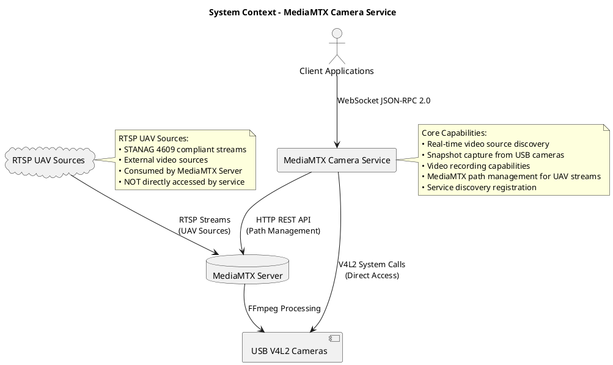

### 1.2 Quality Attributes

| Attribute | Target | Measurement |
|-----------|--------|-------------|
| **Performance** | <100ms response time | 95th percentile API calls |
| **Concurrency** | 1000+ connections | Simultaneous WebSocket clients |
| **Availability** | 99.9% uptime | System operational time |
| **Reliability** | <0.1% error rate | Failed operations ratio |

---

## 2. External Interface Architecture

### 2.1 Exposed Interfaces (Inbound)

**JSON-RPC 2.0 API (Primary External Interface)**
- **Protocol:** WebSocket over TCP
- **Port:** 8002
- **Documentation:** `docs/api/json_rpc_methods.md`
- **Authentication:** JWT Bearer tokens
- **Clients:** Web browsers, mobile apps, desktop applications

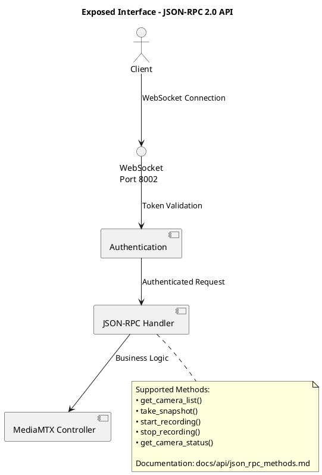

### 2.2 Consumed Interfaces (Outbound)

**MediaMTX REST API (External Dependency)**
- **Protocol:** HTTP/1.1
- **Endpoint:** http://localhost:9997/v3/
- **Purpose:** Stream path management, configuration
- **Required Version:** MediaMTX v1.0+

**V4L2 Hardware Interface**
- **Protocol:** Linux system calls
- **Devices:** /dev/video* character devices
- **Purpose:** Direct camera hardware access

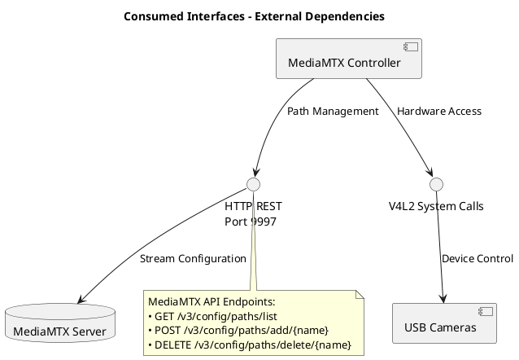

---

## 3. Internal Component Architecture

### 3.1 Component Structure

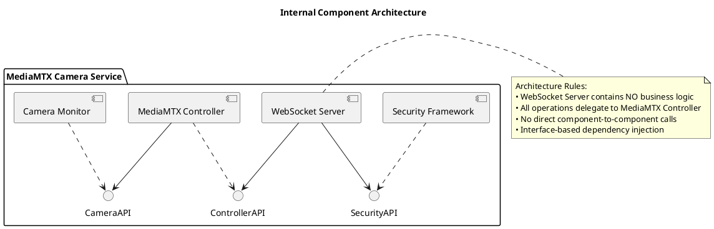

### 3.2 Component Responsibilities

**WebSocket Server (Protocol Layer)**
- JSON-RPC 2.0 protocol implementation
- WebSocket connection management (1000+ concurrent)
- Authentication enforcement
- **Constraint:** NO business logic - delegates all operations

**MediaMTX Controller (Business Logic Layer)**
- Camera operations coordination
- Stream lifecycle management
- API abstraction (camera0 ↔ /dev/video0)
- **Pattern:** Single Source of Truth for all operations

**Camera Monitor (Hardware Abstraction Layer)**
- USB camera detection via V4L2
- Real-time status monitoring
- Hardware capability probing
- **Integration:** Interface-based design with dependency injection

**Security Framework (Cross-Cutting Layer)**
- JWT token management
- Role-based access control (viewer/operator/admin)
- Session management
- **Pattern:** Middleware integration with existing configuration

### 3.3 Internal Interface Contracts

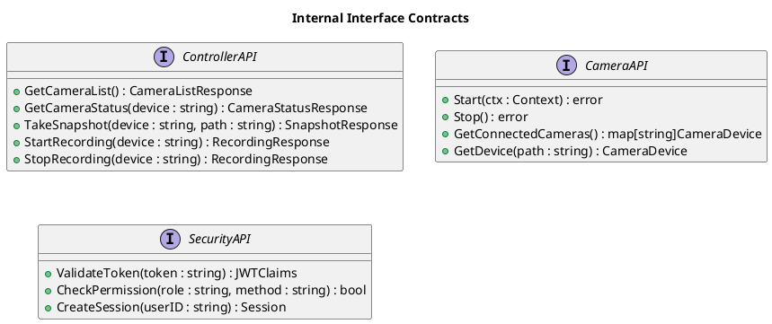

---

## 4. Process Architecture

### 4.1 Authentication Flow

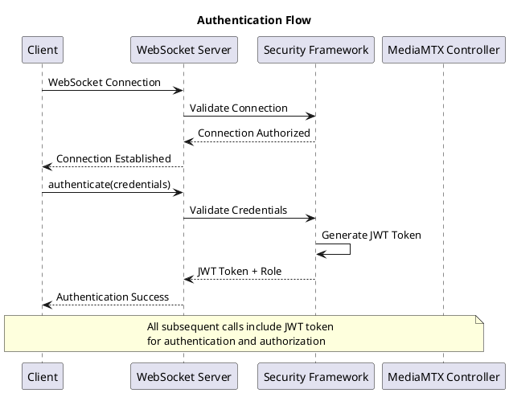

### 4.2 Snapshot Capture Flow

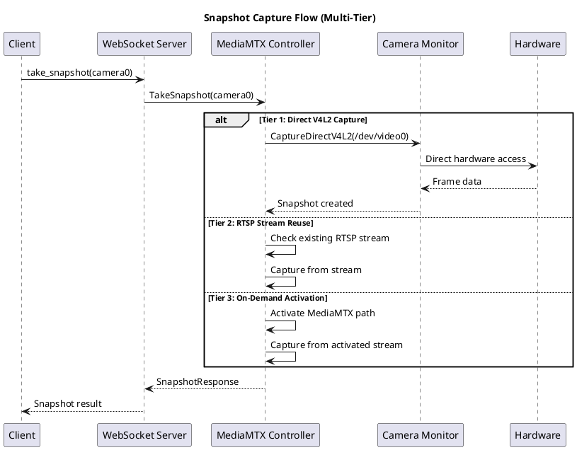

### 4.3 System Startup Coordination

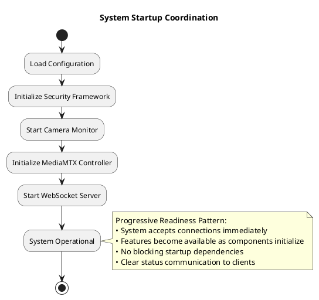

---

## 5. Physical Architecture

### 5.1 Deployment Architecture

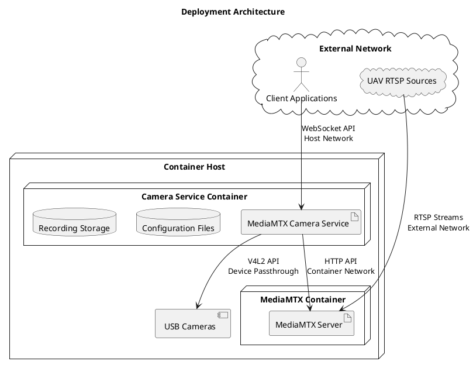

### 5.3 Container Deployment Strategy

**Option 1: Separate Containers (Recommended)**
- **Advantages:**
  - Independent scaling of MediaMTX and camera service
  - Separate lifecycle management and updates
  - Better resource isolation and fault isolation
  - Follows microservices architecture principles

**Option 2: Single Container**
- **Advantages:**
  - Simpler deployment and management
  - Faster inter-process communication
  - Shared resource utilization
  - Reduced network overhead

**Recommendation:** Separate containers for production deployments to enable independent scaling and lifecycle management. Single container acceptable for development or resource-constrained environments.

### 5.2 Network Architecture

| Port | Protocol | Purpose | Security |
|------|----------|---------|----------|
| 8002 | WebSocket | Client API | JWT Authentication |
| 8003 | HTTP | Health checks | Internal only |
| 9997 | HTTP | MediaMTX API | Internal only |
| 8554 | RTSP | Media streaming | Internal only |

---

## 6. Data Architecture

### 6.1 Core Data Models

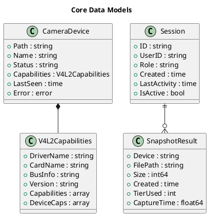

### 6.2 Configuration Schema

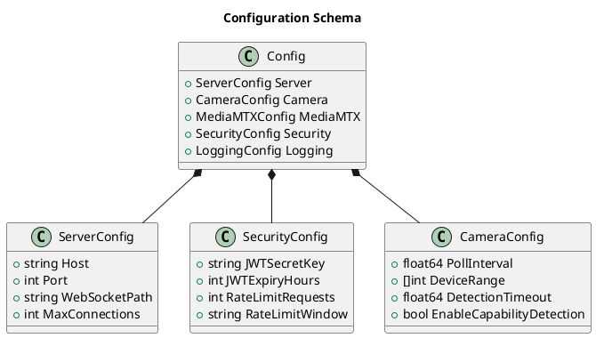

---

## 7. Security Architecture

### 7.1 Security Model

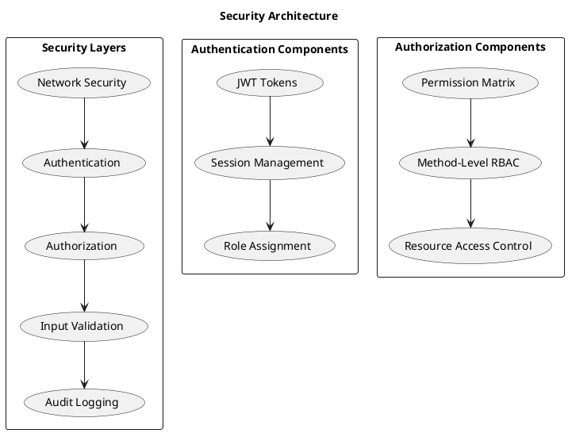

### 7.2 Role-Based Access Control

| Role | Permissions | Use Case |
|------|-------------|----------|
| **viewer** | Read-only access to status and listings | Monitoring dashboards |
| **operator** | Camera control + viewer permissions | Day-to-day operations |
| **admin** | Full system access + metrics | System administration |

### 7.3 Security Implementation

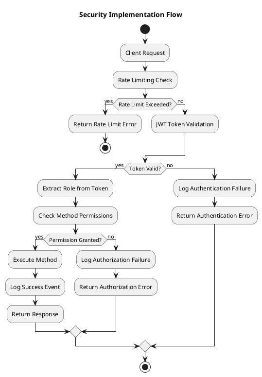

---

## 8. Quality Attributes

### 8.1 Performance Architecture

**Response Time Optimization:**
- **Tier 0 Snapshots:** Direct V4L2 access (<200ms)
- **Connection Pooling:** Reuse MediaMTX connections
- **Event System:** O(log n) client notification scaling
- **Memory Management:** Object pooling for high-frequency operations

**Concurrency Design:**
- **Goroutine-Based:** Non-blocking concurrent operations
- **Channel Communication:** Lock-free inter-component communication
- **Context Cancellation:** Graceful operation termination
- **Resource Limiting:** Bounded goroutine pools

### 8.2 Reliability Architecture

**Fault Tolerance:**
- **Multi-Tier Fallback:** Snapshot capture tier degradation
- **Circuit Breaker:** MediaMTX communication protection
- **Health Monitoring:** Component status tracking
- **Graceful Degradation:** Partial functionality under failure

**Error Handling:**
- **Structured Errors:** Consistent error response format
- **Error Propagation:** Clean error context preservation
- **Recovery Mechanisms:** Automatic retry with exponential backoff
- **Failure Isolation:** Component failures don't cascade

### 8.3 Scalability Architecture

**Horizontal Scaling Readiness:**
- **Stateless Design:** Session state externalization capability
- **Resource Separation:** Compute vs storage separation
- **Event Distribution:** External event system integration ready
- **Service Discovery:** Container orchestration compatibility

---

## 9. Design Principles

### 9.1 Architectural Principles Applied

**Single Responsibility Principle:**
- Each component has one clear responsibility
- Clean separation between protocol, business logic, and hardware
- Interface-based design enables component substitution

**Dependency Inversion Principle:**
- High-level modules don't depend on low-level modules
- Both depend on abstractions (interfaces)
- Enables testing and component replacement

**Open/Closed Principle:**
- Components open for extension via interfaces
- Closed for modification through stable contracts
- Plugin architecture ready for future extensions

---

## 10. Architectural Debt

### 10.1 Current Technical Debt

**Performance Optimization Debt:**
- FFmpeg process management could be optimized with process pooling
- Memory allocation patterns could benefit from object pooling
- Network connection pooling not yet implemented

**Monitoring and Observability Debt:**
- Distributed tracing not implemented
- Advanced metrics collection could be enhanced
- Performance analytics could be more comprehensive

**Extensibility Debt:**
- Plugin architecture interfaces defined but not fully implemented
- External authentication providers not yet supported
- Advanced camera types (IP cameras) have basic support only

### 10.2 Debt Prioritization

**High Priority:**
- Process management optimization for production scalability
- Enhanced error handling and recovery mechanisms

**Medium Priority:**
- Advanced monitoring and observability features
- External authentication provider integration

**Low Priority:**
- Plugin architecture full implementation
- Advanced analytics integration points

---

**Document Status:** Production Architecture Documentation  
**Last Updated:** 2025-01-15  
**Review Cycle:** Quarterly architecture reviews  
**Document Maintenance:** Architecture changes require PM and IV&V approval