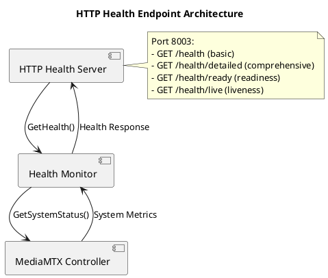

# HTTP Health Endpoints - MediaMTX Camera Service

**Version:** 1.0  
**Date:** 2025-01-18  
**Status:** Production HTTP Health Endpoint Documentation  
**Document Type:** Health API Specification

---

## 1. Overview

The MediaMTX Camera Service implements HTTP health endpoints on port 8003 for container orchestration, load balancers, and monitoring systems. These endpoints follow the thin delegation pattern, providing no business logic and delegating all operations to existing health monitoring components.

### 1.1 Key Features

- **Thin Delegation Pattern**: HTTP server contains NO business logic
- **Component Reuse**: Delegates to existing `HealthMonitor` and `MediaMTXController`
- **Standard Endpoints**: Implements Kubernetes/Docker standard health check endpoints
- **Fast Response**: Health checks respond within 100ms for orchestration compatibility
- **No Authentication**: Health endpoints are internal-only and do not require authentication
- **Configuration-Driven**: All settings via canonical configuration system

---

## 2. Architecture

### 2.1 Component Structure



### 2.2 Configuration

The HTTP health endpoint system is configured through the `http_health` section in the main configuration file:

```yaml
http_health:
  # Server configuration
  enabled: true
  host: "0.0.0.0"
  port: 8003
  read_timeout: "5s"
  write_timeout: "5s"
  idle_timeout: "30s"
  
  # Endpoint configuration
  basic_endpoint: "/health"
  detailed_endpoint: "/health/detailed"
  ready_endpoint: "/health/ready"
  live_endpoint: "/health/live"
  
  # Response configuration
  response_format: "json"
  include_version: true
  include_uptime: true
  include_components: true
  
  # Performance configuration
  max_response_time: "100ms"
  enable_metrics: false
  
  # Security configuration
  internal_only: true
  allowed_ips: []
```

### 2.3 Environment Variables

| Variable | Description | Default |
|----------|-------------|---------|
| `CAMERA_SERVICE_HTTP_HEALTH_ENABLED` | Enable HTTP health server | `true` |
| `CAMERA_SERVICE_HTTP_HEALTH_HOST` | Host to bind to | `0.0.0.0` |
| `CAMERA_SERVICE_HTTP_HEALTH_PORT` | Port to listen on | `8003` |
| `CAMERA_SERVICE_HTTP_HEALTH_READ_TIMEOUT` | Read timeout duration | `5s` |
| `CAMERA_SERVICE_HTTP_HEALTH_WRITE_TIMEOUT` | Write timeout duration | `5s` |
| `CAMERA_SERVICE_HTTP_HEALTH_IDLE_TIMEOUT` | Idle timeout duration | `30s` |

---

## 3. Endpoint Specifications

### 3.1 Basic Health Endpoint

**Endpoint:** `GET /health`  
**Purpose:** Basic health status check  
**Response Time:** <100ms  
**Use Case:** Simple health checks, load balancer health checks

#### Request
```http
GET /health HTTP/1.1
Host: localhost:8003
```

#### Response
```http
HTTP/1.1 200 OK
Content-Type: application/json
Cache-Control: no-cache, no-store, must-revalidate

{
  "status": "healthy",
  "timestamp": "2025-01-18T10:30:00Z",
  "version": "1.0.0",
  "uptime": "72h15m30s"
}
```

#### Status Codes
- `200 OK`: System is healthy
- `500 Internal Server Error`: System error

### 3.2 Detailed Health Endpoint

**Endpoint:** `GET /health/detailed`  
**Purpose:** Comprehensive system status  
**Response Time:** <100ms  
**Use Case:** Detailed monitoring, system diagnostics

#### Request
```http
GET /health/detailed HTTP/1.1
Host: localhost:8003
```

#### Response
```http
HTTP/1.1 200 OK
Content-Type: application/json
Cache-Control: no-cache, no-store, must-revalidate

{
  "status": "healthy",
  "timestamp": "2025-01-18T10:30:00Z",
  "version": "1.0.0",
  "uptime": "72h15m30s",
  "components": [
    {
      "name": "mediamtx",
      "status": "healthy",
      "message": "MediaMTX server is running",
      "last_checked": "2025-01-18T10:29:45Z",
      "details": {
        "version": "1.0.0",
        "active_streams": 2
      }
    },
    {
      "name": "cameras",
      "status": "healthy",
      "message": "Camera monitoring active",
      "last_checked": "2025-01-18T10:29:50Z",
      "details": {
        "connected_cameras": 1,
        "total_cameras": 1
      }
    },
    {
      "name": "storage",
      "status": "healthy",
      "message": "Storage system operational",
      "last_checked": "2025-01-18T10:29:55Z",
      "details": {
        "free_space": "85%",
        "total_space": "500GB"
      }
    }
  ],
  "metrics": {
    "uptime_seconds": 259530,
    "component_count": 3,
    "components_healthy": 3,
    "components_degraded": 0,
    "components_unhealthy": 0
  },
  "environment": "production"
}
```

#### Status Codes
- `200 OK`: System is healthy
- `500 Internal Server Error`: System error

### 3.3 Readiness Probe Endpoint

**Endpoint:** `GET /health/ready`  
**Purpose:** Kubernetes readiness probe  
**Response Time:** <100ms  
**Use Case:** Container orchestration, service discovery

#### Request
```http
GET /health/ready HTTP/1.1
Host: localhost:8003
```

#### Response (Ready)
```http
HTTP/1.1 200 OK
Content-Type: application/json
Cache-Control: no-cache, no-store, must-revalidate

{
  "ready": true,
  "timestamp": "2025-01-18T10:30:00Z",
  "message": "System is ready"
}
```

#### Response (Not Ready)
```http
HTTP/1.1 503 Service Unavailable
Content-Type: application/json
Cache-Control: no-cache, no-store, must-revalidate

{
  "ready": false,
  "timestamp": "2025-01-18T10:30:00Z",
  "message": "System not ready: mediamtx is unhealthy"
}
```

#### Status Codes
- `200 OK`: System is ready to accept requests
- `503 Service Unavailable`: System is not ready
- `500 Internal Server Error`: System error

### 3.4 Liveness Probe Endpoint

**Endpoint:** `GET /health/live`  
**Purpose:** Kubernetes liveness probe  
**Response Time:** <100ms  
**Use Case:** Container orchestration, process monitoring

#### Request
```http
GET /health/live HTTP/1.1
Host: localhost:8003
```

#### Response (Alive)
```http
HTTP/1.1 200 OK
Content-Type: application/json
Cache-Control: no-cache, no-store, must-revalidate

{
  "alive": true,
  "timestamp": "2025-01-18T10:30:00Z",
  "message": "System is alive"
}
```

#### Response (Not Alive)
```http
HTTP/1.1 503 Service Unavailable
Content-Type: application/json
Cache-Control: no-cache, no-store, must-revalidate

{
  "alive": false,
  "timestamp": "2025-01-18T10:30:00Z",
  "message": "System is not alive"
}
```

#### Status Codes
- `200 OK`: System is alive and responsive
- `503 Service Unavailable`: System is not alive
- `500 Internal Server Error`: System error

---

## 4. Response Format

### 4.1 Health Status Values

| Status | Description |
|--------|-------------|
| `healthy` | System is operating normally |
| `unhealthy` | System has critical issues |
| `degraded` | System is operating with reduced functionality |

### 4.2 Component Status Structure

```json
{
  "name": "component_name",
  "status": "healthy|unhealthy|degraded",
  "message": "Human-readable status message",
  "last_checked": "2025-01-18T10:30:00Z",
  "details": {
    "key": "value"
  }
}
```

### 4.3 Error Response Format

```json
{
  "error": "Error message",
  "timestamp": "2025-01-18T10:30:00Z",
  "status": 500
}
```

---

## 5. Integration

### 5.1 Service Integration

The HTTP health server integrates with the main service through the health monitoring system:

```go
// Create health monitor
healthMonitor := health.NewHealthMonitor("1.0.0")

// Create HTTP health server
healthServer, err := health.NewHTTPHealthServer(&cfg.HTTPHealth, healthMonitor, logger)
if err != nil {
    return fmt.Errorf("failed to create HTTP health server: %w", err)
}

// Start health server
go func() {
    if err := healthServer.Start(ctx); err != nil {
        logger.WithError(err).Error("HTTP health server failed")
    }
}()
```

### 5.2 Configuration Integration

The HTTP health server uses the canonical configuration system:

```go
// Load configuration
configManager := config.CreateConfigManager()
if err := configManager.LoadConfig(configPath); err != nil {
    return fmt.Errorf("failed to load configuration: %w", err)
}

cfg := configManager.GetConfig()
healthServer, err := health.NewHTTPHealthServer(&cfg.HTTPHealth, healthMonitor, logger)
```

### 5.3 Logging Integration

The HTTP health server uses the canonical logging system:

```go
// Create logger
logger := logging.GetLogger("http-health-server")

// Log health server operations
logger.WithFields(logging.Fields{
    "endpoint": "/health",
    "status": "healthy",
    "response_time": "50ms",
}).Info("Health check completed")
```

---

## 6. Kubernetes Integration

### 6.1 Deployment Configuration

```yaml
apiVersion: apps/v1
kind: Deployment
metadata:
  name: camera-service
spec:
  template:
    spec:
      containers:
      - name: camera-service
        image: camera-service:latest
        ports:
        - containerPort: 8003
          name: health
        livenessProbe:
          httpGet:
            path: /health/live
            port: 8003
          initialDelaySeconds: 30
          periodSeconds: 10
          timeoutSeconds: 5
          failureThreshold: 3
        readinessProbe:
          httpGet:
            path: /health/ready
            port: 8003
          initialDelaySeconds: 5
          periodSeconds: 5
          timeoutSeconds: 3
          failureThreshold: 3
```

### 6.2 Service Configuration

```yaml
apiVersion: v1
kind: Service
metadata:
  name: camera-service
spec:
  selector:
    app: camera-service
  ports:
  - name: health
    port: 8003
    targetPort: 8003
    protocol: TCP
  - name: websocket
    port: 8002
    targetPort: 8002
    protocol: TCP
```

---

## 7. Monitoring and Alerting

### 7.1 Prometheus Integration

The health endpoints can be monitored using Prometheus:

```yaml
# prometheus.yml
scrape_configs:
- job_name: 'camera-service-health'
  static_configs:
  - targets: ['camera-service:8003']
  metrics_path: /health/detailed
  scrape_interval: 30s
```

### 7.2 Grafana Dashboard

Create a Grafana dashboard to monitor health status:

```json
{
  "dashboard": {
    "title": "Camera Service Health",
    "panels": [
      {
        "title": "Health Status",
        "type": "stat",
        "targets": [
          {
            "expr": "up{job=\"camera-service-health\"}",
            "legendFormat": "Health Status"
          }
        ]
      }
    ]
  }
}
```

---

## 8. Best Practices

### 8.1 Health Check Design

- **Fast Response**: Keep response times under 100ms
- **Lightweight**: Avoid expensive operations in health checks
- **Reliable**: Health checks should not fail due to transient issues
- **Informative**: Provide meaningful status information

### 8.2 Security

- **Internal Only**: Restrict access to internal networks
- **No Authentication**: Keep health checks simple and fast
- **No Sensitive Data**: Avoid exposing sensitive information
- **Rate Limiting**: Implement rate limiting if needed

### 8.3 Operations

- **Monitoring**: Monitor health endpoint availability
- **Alerting**: Set up alerts for health check failures
- **Documentation**: Keep endpoint documentation up to date
- **Testing**: Regularly test health check endpoints

---

## 9. Troubleshooting

### 9.1 Common Issues

#### Health Endpoint Not Responding

**Symptoms:** Health endpoints return connection refused or timeout

**Causes:**
- HTTP health server not started
- Port 8003 not accessible
- Firewall blocking access

**Solutions:**
- Check if HTTP health server is enabled in configuration
- Verify port 8003 is open and accessible
- Check firewall rules

#### Health Status Always Unhealthy

**Symptoms:** Health endpoints always return unhealthy status

**Causes:**
- Health monitor not properly initialized
- Component status not being updated
- Configuration issues

**Solutions:**
- Check health monitor initialization
- Verify component status updates
- Review configuration settings

#### Slow Response Times

**Symptoms:** Health endpoints respond slowly (>100ms)

**Causes:**
- Expensive operations in health checks
- Network latency
- System resource constraints

**Solutions:**
- Optimize health check operations
- Check network connectivity
- Monitor system resources

### 9.2 Debugging

Enable debug logging for health endpoints:

```yaml
logging:
  level: debug
  console_enabled: true
```

Check health server logs:

```bash
journalctl -u camera-service -f | grep http-health
```

Test health endpoints manually:

```bash
# Basic health check
curl -v http://localhost:8003/health

# Detailed health check
curl -v http://localhost:8003/health/detailed

# Readiness probe
curl -v http://localhost:8003/health/ready

# Liveness probe
curl -v http://localhost:8003/health/live
```

---

## 10. API Reference

### 10.1 HealthAPI Interface

```go
type HealthAPI interface {
    GetHealth(ctx context.Context) (*HealthResponse, error)
    GetDetailedHealth(ctx context.Context) (*DetailedHealthResponse, error)
    IsReady(ctx context.Context) (*ReadinessResponse, error)
    IsAlive(ctx context.Context) (*LivenessResponse, error)
}
```

### 10.2 Response Structures

```go
type HealthResponse struct {
    Status    HealthStatus `json:"status"`
    Timestamp time.Time    `json:"timestamp"`
    Version   string       `json:"version,omitempty"`
    Uptime    string       `json:"uptime,omitempty"`
}

type DetailedHealthResponse struct {
    Status      HealthStatus       `json:"status"`
    Timestamp   time.Time          `json:"timestamp"`
    Version     string             `json:"version,omitempty"`
    Uptime      string             `json:"uptime,omitempty"`
    Components  []ComponentStatus  `json:"components,omitempty"`
    Metrics     map[string]interface{} `json:"metrics,omitempty"`
    Environment string             `json:"environment,omitempty"`
}

type ReadinessResponse struct {
    Ready     bool      `json:"ready"`
    Timestamp time.Time `json:"timestamp"`
    Message   string    `json:"message,omitempty"`
}

type LivenessResponse struct {
    Alive     bool      `json:"alive"`
    Timestamp time.Time `json:"timestamp"`
    Message   string    `json:"message,omitempty"`
}
```

---

**Document Status:** Complete HTTP Health Endpoint Documentation  
**Standards Applied:** IEEE 42010 (Stakeholder Concerns), Arc42 (Solution Strategy)  
**Scope Coverage:** HTTP health endpoints with thin delegation pattern  
**Last Updated:** 2025-01-18  
**Review Cycle:** Quarterly health monitoring reviews with stakeholder validation  
**Document Maintenance:** Health endpoint changes require formal approval process
