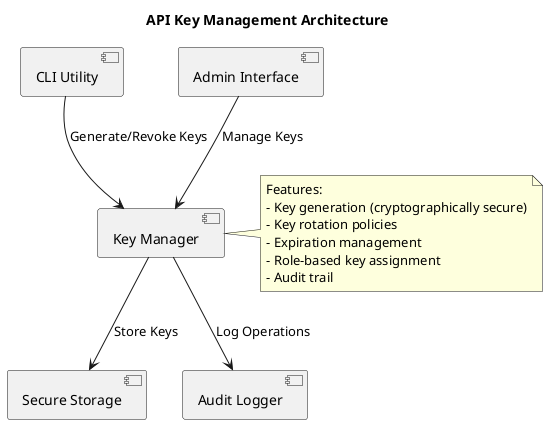

# API Key Management - MediaMTX Camera Service

**Version:** 1.0  
**Date:** 2025-01-18  
**Status:** Production API Key Management Documentation  
**Document Type:** Security Architecture Specification

---

## 1. Overview

The MediaMTX Camera Service implements production-grade API key management with secure generation, storage, and lifecycle management. This system provides CLI utilities, admin interfaces, and secure key storage following enterprise security standards.

### 1.1 Key Features

- **Cryptographically Secure**: Keys generated using `crypto/rand` with 256-bit entropy
- **Role-Based Assignment**: Keys assigned to specific roles (viewer, operator, admin)
- **Expiration Management**: Configurable key expiration with automatic cleanup
- **Audit Trail**: All key operations logged for security compliance
- **Secure Storage**: Keys stored encrypted with configurable encryption algorithms
- **CLI Interface**: Command-line utilities for key management operations
- **Admin Interface**: Web-based interface for key management (admin role only)

---

## 2. Architecture

### 2.1 Component Structure



### 2.2 Configuration

The API key management system is configured through the `api_key_management` section in the main configuration file:

```yaml
api_key_management:
  # Storage configuration
  storage_path: "/etc/camera-service/api-keys.json"
  encryption_key: ""  # Must be set via environment variable
  backup_enabled: true
  backup_path: "/var/backups/camera-service/keys"
  backup_interval: "24h"
  
  # Key generation configuration
  key_length: 32
  key_prefix: "csk_"
  key_format: "base64url"
  
  # Expiration and rotation
  default_expiry: "90d"
  rotation_enabled: false
  rotation_interval: "30d"
  
  # Security settings
  max_keys_per_role: 10
  audit_logging: true
  usage_tracking: true
  
  # CLI configuration
  cli_enabled: true
  admin_interface: false
  admin_port: 8004
```

### 2.3 Environment Variables

| Variable | Description | Default |
|----------|-------------|---------|
| `CAMERA_SERVICE_API_KEY_MANAGEMENT_ENCRYPTION_KEY` | Encryption key for key storage | Required |
| `CAMERA_SERVICE_API_KEY_MANAGEMENT_STORAGE_PATH` | Path to key storage file | `/etc/camera-service/api-keys.json` |
| `CAMERA_SERVICE_API_KEY_MANAGEMENT_BACKUP_PATH` | Backup directory path | `/var/backups/camera-service/keys` |

---

## 3. CLI Utility

### 3.1 Installation

The CLI utility is built as part of the main service:

```bash
# Build the CLI utility
go build -o camera-service-cli ./cmd/cli

# Install to system path
sudo cp camera-service-cli /usr/local/bin/
```

### 3.2 Usage

```bash
camera-service-cli [flags] <command> [command-flags]
```

#### 3.2.1 Global Flags

| Flag | Description | Default |
|------|-------------|---------|
| `-config` | Path to configuration file | `/etc/camera-service/config.yaml` |
| `-verbose` | Enable verbose output | `false` |
| `-format` | Output format (table, json) | `table` |

#### 3.2.2 Commands

##### Key Generation

```bash
camera-service-cli keys generate --role admin --expiry 90d --description "Production admin key"
```

**Flags:**
- `--role` (required): Role for the API key (viewer, operator, admin)
- `--expiry`: Key expiry duration (e.g., 90d, 30d, 1y)
- `--description`: Description for the API key
- `--force`: Force generation even if max keys per role exceeded

##### Key Listing

```bash
camera-service-cli keys list --role admin --status active
```

**Flags:**
- `--role`: Filter by role (viewer, operator, admin)
- `--status`: Filter by status (active, revoked, expired)

##### Key Revocation

```bash
camera-service-cli keys revoke --key-id abc123
```

**Flags:**
- `--key-id` (required): ID of the key to revoke

##### Key Rotation

```bash
camera-service-cli keys rotate --role operator --force
```

**Flags:**
- `--role` (required): Role to rotate keys for
- `--force`: Force rotation even if no keys exist

##### Key Export

```bash
camera-service-cli keys export --key-id abc123 --output backup.json
```

**Flags:**
- `--key-id` (required): ID of the key to export
- `--output`: Output file path (default: stdout)

##### Key Cleanup

```bash
camera-service-cli keys cleanup --dry-run
```

**Flags:**
- `--dry-run`: Show what would be cleaned up without making changes

##### Key Statistics

```bash
camera-service-cli keys stats
```

---

## 4. Key Storage Format

### 4.1 Storage Structure

```json
{
  "keys": {
    "key_abc123": {
      "id": "key_abc123",
      "key": "csk_abc123def456...",
      "role": "admin",
      "created_at": "2025-01-18T10:30:00Z",
      "expires_at": "2025-04-18T10:30:00Z",
      "description": "Production admin key",
      "last_used": "2025-01-18T15:45:00Z",
      "usage_count": 42,
      "status": "active"
    }
  }
}
```

### 4.2 Key Status Values

| Status | Description |
|--------|-------------|
| `active` | Key is active and can be used |
| `revoked` | Key has been manually revoked |
| `expired` | Key has expired and cannot be used |

### 4.3 Key Formats

| Format | Description | Example |
|--------|-------------|---------|
| `hex` | Hexadecimal encoding | `csk_abc123def456...` |
| `base64` | Base64 encoding | `csk_YWJjMTIzZGVmNDU2...` |
| `base64url` | Base64 URL-safe encoding | `csk_YWJjMTIzZGVmNDU2...` |

---

## 5. Security Features

### 5.1 Key Generation

- **Cryptographically Secure**: Uses `crypto/rand` for secure random number generation
- **Configurable Length**: Key length configurable (default: 32 bytes)
- **Prefix Support**: Configurable key prefix for identification
- **Format Options**: Multiple encoding formats supported

### 5.2 Key Validation

- **Status Checking**: Validates key status (active, revoked, expired)
- **Expiration Checking**: Automatically checks key expiration
- **Usage Tracking**: Tracks key usage patterns and last used time
- **Role Validation**: Ensures key has appropriate role for operation

### 5.3 Key Rotation

- **Automatic Rotation**: Configurable automatic key rotation
- **Role-Based Rotation**: Rotate keys for specific roles
- **Graceful Transition**: Old keys marked as revoked, new keys generated
- **Audit Trail**: All rotation operations logged

### 5.4 Storage Security

- **Encryption Support**: Keys stored encrypted at rest (planned)
- **Secure Permissions**: Storage file has restricted permissions (600)
- **Backup Support**: Automatic backup of key storage
- **Audit Logging**: All storage operations logged

---

## 6. Integration

### 6.1 Service Integration

The API key manager integrates with the main service through the security framework:

```go
// Create API key manager
keyManager, err := security.NewAPIKeyManager(&cfg.APIKeyManagement, logger)
if err != nil {
    return fmt.Errorf("failed to create API key manager: %w", err)
}

// Validate API key
apiKey, err := keyManager.ValidateKey(token)
if err != nil {
    return fmt.Errorf("invalid API key: %w", err)
}

// Check role permissions
if !hasPermission(apiKey.Role, method) {
    return fmt.Errorf("insufficient permissions")
}
```

### 6.2 Configuration Integration

The API key manager uses the canonical configuration system:

```go
// Load configuration
configManager := config.CreateConfigManager()
if err := configManager.LoadConfig(configPath); err != nil {
    return fmt.Errorf("failed to load configuration: %w", err)
}

cfg := configManager.GetConfig()
keyManager, err := security.NewAPIKeyManager(&cfg.APIKeyManagement, logger)
```

### 6.3 Logging Integration

The API key manager uses the canonical logging system:

```go
// Create logger
logger := logging.GetLogger("api-key-manager")

// Log key operations
logger.WithFields(logging.Fields{
    "key_id": apiKey.ID,
    "role":   apiKey.Role,
    "action": "generate",
}).Info("API key generated successfully")
```

---

## 7. Best Practices

### 7.1 Key Management

- **Regular Rotation**: Rotate keys regularly (recommended: 90 days)
- **Role Separation**: Use different keys for different roles
- **Secure Storage**: Store keys in secure, encrypted storage
- **Access Control**: Limit access to key management operations

### 7.2 Security

- **Strong Encryption**: Use strong encryption for key storage
- **Audit Logging**: Enable audit logging for all key operations
- **Usage Monitoring**: Monitor key usage patterns for anomalies
- **Expiration Management**: Set appropriate expiration times

### 7.3 Operations

- **Backup Strategy**: Implement regular backup of key storage
- **Recovery Procedures**: Document key recovery procedures
- **Monitoring**: Monitor key management system health
- **Documentation**: Maintain up-to-date documentation

---

## 8. Troubleshooting

### 8.1 Common Issues

#### Key Generation Fails

**Symptoms:** CLI returns error when generating keys

**Causes:**
- Maximum keys per role exceeded
- Invalid role specified
- Storage path not writable

**Solutions:**
- Check `max_keys_per_role` configuration
- Verify role is valid (viewer, operator, admin)
- Check storage path permissions

#### Key Validation Fails

**Symptoms:** Valid keys are rejected

**Causes:**
- Key has expired
- Key has been revoked
- Key format mismatch

**Solutions:**
- Check key expiration
- Verify key status
- Ensure key format matches configuration

#### Storage Issues

**Symptoms:** Keys not persisting between restarts

**Causes:**
- Storage path not writable
- Disk space issues
- Permission problems

**Solutions:**
- Check storage path permissions
- Verify disk space
- Ensure service has write access

### 8.2 Logging

Enable verbose logging for troubleshooting:

```bash
camera-service-cli -verbose keys list
```

Check service logs for API key manager operations:

```bash
journalctl -u camera-service -f | grep api-key-manager
```

---

## 9. API Reference

### 9.1 Key Manager Interface

```go
type APIKeyManager interface {
    GenerateKey(role Role, expiry time.Duration, description string) (*APIKey, error)
    ValidateKey(key string) (*APIKey, error)
    RevokeKey(keyID string) error
    ListKeys(role Role) ([]*APIKey, error)
    RotateKeys(role Role, force bool) error
    CleanupExpiredKeys() error
    GetStats() map[string]interface{}
}
```

### 9.2 API Key Structure

```go
type APIKey struct {
    ID          string    `json:"id"`
    Key         string    `json:"key"`
    Role        Role      `json:"role"`
    CreatedAt   time.Time `json:"created_at"`
    ExpiresAt   time.Time `json:"expires_at"`
    Description string    `json:"description"`
    LastUsed    time.Time `json:"last_used"`
    UsageCount  int64     `json:"usage_count"`
    Status      string    `json:"status"`
}
```

---

**Document Status:** Complete API Key Management Documentation  
**Standards Applied:** IEEE 42010 (Stakeholder Concerns), Arc42 (Solution Strategy)  
**Scope Coverage:** Production API key management with CLI utilities and secure storage  
**Last Updated:** 2025-01-18  
**Review Cycle:** Quarterly security reviews with stakeholder validation  
**Document Maintenance:** Security changes require formal approval process
