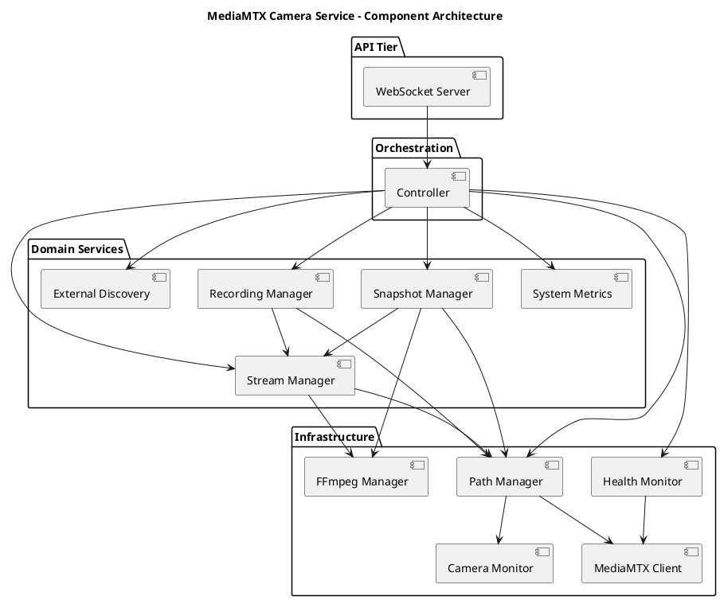
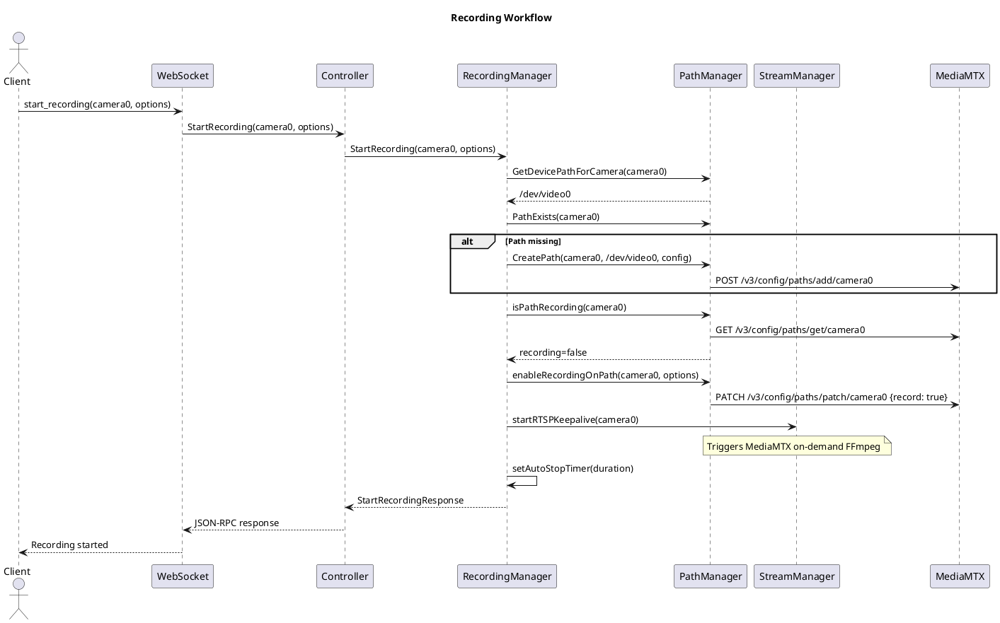
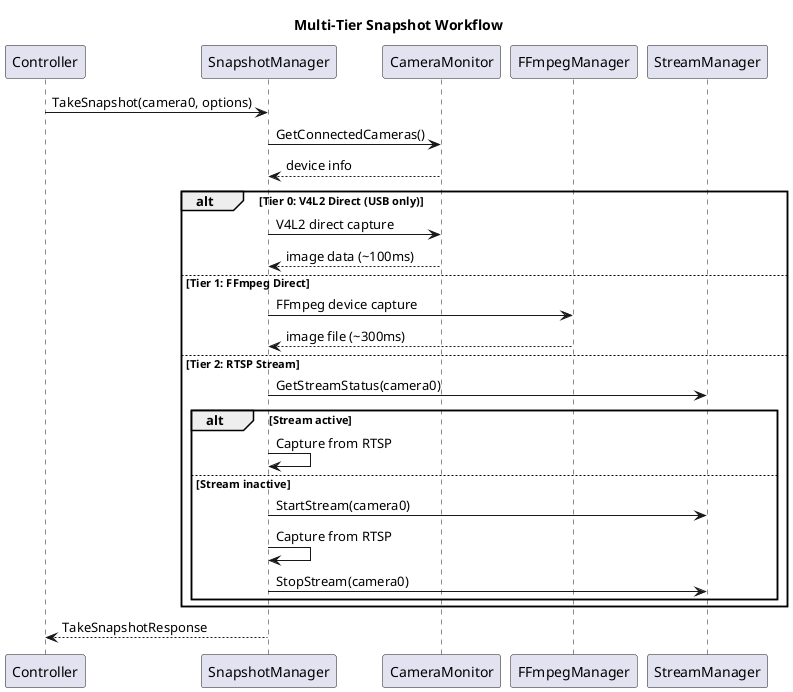
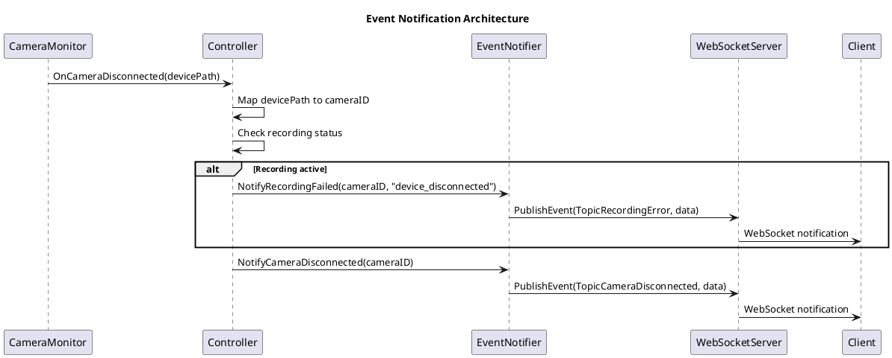

# MediaMTX Camera Service - Engineering Architecture

**Version:** 3.0  
**Date:** 2025-01-18  
**Document Type:** Engineering Architecture Specification  
**Audience:** Software Engineers, System Architects

---

## 1. Architectural Overview

### 1.1 System Pattern

**Component-Based Architecture** with **Central Orchestrator**.

The system implements a hub-and-spoke model where the Controller coordinates domain-specific managers. Components have functional dependencies based on business requirements, not artificial layering.

### 1.2 Component Topology



---

## 2. Core Workflows

### 2.1 Recording Operation



### 2.2 Snapshot Operation



### 2.3 Event Notification



---

## 3. Component Specifications

### 3.1 Controller (Central Orchestrator)

**File**: `controller.go`  
**Function**: Component coordination and API orchestration  
**Dependencies**: All managers and services  

**Key Methods**:
```go
// Recording operations
StartRecording(ctx, cameraID, options) (*StartRecordingResponse, error)
StopRecording(ctx, cameraID) (*StopRecordingResponse, error)

// Snapshot operations  
TakeAdvancedSnapshot(ctx, cameraID, options) (*TakeSnapshotResponse, error)

// Stream operations
StartStreaming(ctx, cameraID) (*GetStreamURLResponse, error)
GetStreamStatus(ctx, cameraID) (*GetStreamStatusResponse, error)

// Camera operations
GetCameraList(ctx) (*CameraListResponse, error)
GetCameraStatus(ctx, device) (*GetCameraStatusResponse, error)
```

### 3.2 RecordingManager (Domain Service)

**File**: `recording_manager.go`  
**Function**: Recording lifecycle management  
**Architecture**: Stateless - MediaMTX API as source of truth  

**Key Features**:
- Auto-stop timer management using `sync.Map`
- RTSP keepalive coordination for on-demand activation
- MediaMTX path configuration management

### 3.3 SnapshotManager (Domain Service)

**File**: `snapshot_manager.go`  
**Function**: Multi-tier snapshot capture  
**Architecture**: Intelligent fallback system  

**Tier Strategy**:
- **Tier 0**: V4L2 direct (USB devices, <100ms)
- **Tier 1**: FFmpeg direct (USB devices, ~300ms)  
- **Tier 2**: RTSP immediate (existing streams)
- **Tier 3**: RTSP activation (create stream then capture)

### 3.4 PathManager (Infrastructure Service)

**File**: `path_manager.go`  
**Function**: MediaMTX API integration and device abstraction  

**Core Services**:
- Camera ID ↔ Device path mapping
- MediaMTX path lifecycle management
- Camera capability extraction
- Idempotent path operations

### 3.5 StreamManager (Domain Service)

**File**: `stream_manager.go`  
**Function**: Stream lifecycle and FFmpeg coordination  

**Core Features**:
- FFmpeg command generation
- Stream status monitoring
- On-demand stream activation
- Stream URL management

---

## 4. Integration Patterns

### 4.1 MediaMTX API Integration

**Pattern**: Typed HTTP API communication  
**Implementation**: `api_types.go` provides 1:1 mapping to MediaMTX Swagger specification  

**Key Types**:
```go
type PathConf struct {
    Record             bool   `json:"record,omitempty"`
    RecordPath         string `json:"recordPath,omitempty"`
    RecordFormat       string `json:"recordFormat,omitempty"`
    RunOnDemand        string `json:"runOnDemand,omitempty"`
    Source             string `json:"source,omitempty"`
}
```

### 4.2 Event System Architecture

**Pattern**: Topic-based event subscriptions  
**Implementation**: WebSocket event manager with topic filtering  

**Event Categories**:
- **Camera Events**: connection, disconnection, status changes
- **Recording Events**: start, stop, progress, errors
- **Snapshot Events**: capture completion, errors
- **System Events**: health, startup, shutdown

### 4.3 Hardware Abstraction

**Pattern**: Event-driven hardware monitoring  
**Implementation**: CameraMonitor provides device discovery and status events  

**Device Types**:
- **USB Cameras**: V4L2 devices (/dev/videoN)
- **External Streams**: RTSP URLs discovered on network
- **UAV Streams**: Skydio-specific discovery protocols

---

## 5. Concurrency and Performance

### 5.1 Concurrency Patterns

| Component | Pattern | Synchronization |
|-----------|---------|-----------------|
| **Controller** | Atomic state management | `atomic.Int32` for running state |
| **RecordingManager** | Lock-free timer storage | `sync.Map` for auto-stop timers |
| **PathManager** | Per-path locking | Individual `sync.Mutex` per path |
| **StreamManager** | Lock-free command cache | `sync.Map` for FFmpeg commands |
| **WebSocketServer** | Protected client map | `sync.RWMutex` for client access |

### 5.2 Performance Characteristics

| Operation | Target | Implementation Strategy |
|-----------|--------|------------------------|
| **V4L2 Snapshot** | <100ms | Direct hardware access |
| **Recording Start** | <2s | MediaMTX API + RTSP activation |
| **Stream Start** | <3s | FFmpeg process startup |
| **Event Delivery** | <20ms | Topic-based subscription filtering |

---

## 6. Configuration Architecture

### 6.1 Configuration Structure

```go
type Config struct {
    MediaMTX    MediaMTXConfig    // MediaMTX server integration
    Recording   RecordingConfig   // Recording behavior
    Camera      CameraConfig      // Hardware discovery
    Security    SecurityConfig    // Authentication and authorization
}

type MediaMTXConfig struct {
    Host           string // MediaMTX server host
    APIPort        int    // REST API port
    RTSPPort       int    // RTSP streaming port
    RecordingsPath string // File storage location
    SnapshotsPath  string // Snapshot storage location
}
```

### 6.2 Configuration Integration

**ConfigIntegration** provides:
- Centralized configuration access
- Validation and defaults
- Type-safe configuration retrieval

---

## 7. Error Handling Strategy

### 7.1 Error Categories

| Error Type | Handling Strategy | Implementation |
|------------|------------------|----------------|
| **MediaMTX API** | Structured errors with retry | `MediaMTXError` with HTTP details |
| **Hardware** | Graceful degradation | Multi-tier fallback in snapshots |
| **Network** | Circuit breaker pattern | HealthMonitor failure tracking |
| **Validation** | Early rejection | Input validation at API boundary |

### 7.2 Recovery Mechanisms

- **Automatic Retry**: MediaMTX operations with exponential backoff
- **Circuit Breaker**: Health monitoring with configurable thresholds
- **Tier Fallback**: Snapshot capture tier degradation
- **Event-Driven Recovery**: Hardware reconnection handling

---

## 8. Extension Guidelines

### 8.1 Adding New Camera Types

1. **CameraMonitor**: Add device detection logic
2. **SnapshotManager**: Add tier handling for new device type
3. **PathManager**: Update device mapping if needed
4. **No changes required**: Controller, API layer

### 8.2 Adding New Stream Protocols

1. **ExternalDiscovery**: Add protocol-specific discovery
2. **StreamManager**: Add protocol handling logic
3. **PathManager**: Update for protocol-specific configuration
4. **No changes required**: Controller, API layer

### 8.3 Adding New Event Types

1. **events.go**: Define new `EventTopic` constants
2. **Domain Manager**: Add event emission logic
3. **No changes required**: Event system handles new topics automatically

---

## 9. Key Architectural Decisions

### 9.1 Stateless Recording

**Decision**: Use MediaMTX API as single source of truth for recording state.

**Rationale**: 
- Eliminates state synchronization complexity
- Supports service restarts without state loss
- Leverages MediaMTX's built-in recording management

**Implementation**: Query MediaMTX API for recording status instead of maintaining local state.

### 9.2 Multi-Tier Snapshot Strategy

**Decision**: Implement intelligent performance-based fallback system.

**Rationale**:
- USB devices support direct V4L2 access (fastest)
- External streams require RTSP capture (slower but necessary)
- Provides optimal performance for each device type

**Implementation**: Automatic tier selection based on device type and availability.

### 9.3 Device Abstraction

**Decision**: Abstract hardware paths through stable camera identifiers.

**Rationale**:
- External API stability regardless of hardware changes
- Simplified client integration
- Clean separation between API and hardware concerns

**Implementation**: Bidirectional mapping between `camera0` ↔ `/dev/video0`.

---

## 10. Integration Specifications

### 10.1 MediaMTX Server Integration

**Protocol**: HTTP REST API (OpenAPI 3.0)  
**Type Safety**: `api_types.go` provides 1:1 mapping to MediaMTX Swagger  
**Features Utilized**:
- Dynamic path configuration
- Recording control via path patching
- Stream status monitoring
- STANAG 4609 video format support (native MediaMTX capability)

### 10.2 Hardware Integration

**V4L2 Devices**: Direct USB camera access for optimal snapshot performance  
**Camera Discovery**: Event-driven hardware monitoring  
**Device Events**: Connection/disconnection notifications  

### 10.3 External Stream Integration

**Network Discovery**: Configurable RTSP stream scanning  
**UAV Support**: Skydio-specific discovery protocols  
**Protocol Support**: Generic RTSP stream integration  

---

## 11. Event Architecture

### 11.1 Event System Design

**Pattern**: Topic-based publish/subscribe with WebSocket delivery  
**Scalability**: Subscription filtering reduces broadcast overhead  
**Reliability**: Asynchronous processing with error isolation  

### 11.2 Event Categories

```go
// Core event topics
const (
    TopicCameraConnected     = "camera.connected"
    TopicCameraDisconnected  = "camera.disconnected"
    TopicRecordingStart      = "recording.start"
    TopicRecordingStop       = "recording.stop"
    TopicRecordingError      = "recording.error"
    TopicSnapshotTaken       = "snapshot.taken"
    TopicSystemHealth        = "system.health"
)
```

### 11.3 Subscription Management

**Client Subscriptions**: Per-client topic filtering  
**Event Delivery**: Authenticated clients only  
**Performance**: Atomic counters for subscription metrics  

---

## 12. Data Models

### 12.1 Core Abstractions

```go
// Primary identifiers
type CameraID string    // External API: camera0, camera1
type DevicePath string  // Internal hardware: /dev/video0, /dev/video1

// MediaMTX integration
type PathConf struct {
    Record             bool   `json:"record,omitempty"`
    RecordPath         string `json:"recordPath,omitempty"`
    RecordFormat       string `json:"recordFormat,omitempty"`
    RunOnDemand        string `json:"runOnDemand,omitempty"`
    Source             string `json:"source,omitempty"`
}
```

### 12.2 Response Types

All manager operations return JSON-RPC 2.0 compliant response structures defined in `rpc_types.go`. These provide consistent API contracts and eliminate response formatting at the API layer.

---

## 13. Concurrency Model

### 13.1 Thread Safety Strategy

**Lock-Free Operations**: High-frequency operations use `sync.Map`  
**Granular Locking**: Per-resource locks (e.g., per-path mutexes)  
**Atomic Counters**: State flags and metrics use atomic operations  
**Reader-Writer Locks**: Shared data with infrequent updates  

### 13.2 Lifecycle Management

**Progressive Startup**: Components start in dependency order  
**Graceful Shutdown**: Context-based cancellation propagation  
**Event-Driven Readiness**: Asynchronous component readiness monitoring  

---

## 14. Extension Points

### 14.1 Component Extension

**New Domain Services**: Implement domain-specific manager with Controller integration  
**New Infrastructure**: Add infrastructure service with appropriate manager dependencies  
**New Protocols**: Extend existing managers with protocol-specific handling  

### 14.2 API Extension

**New Methods**: Add WebSocket method with Controller delegation  
**New Events**: Define event topic and add emission logic  
**New Response Types**: Add to `rpc_types.go` with proper JSON-RPC 2.0 structure  

---

## 15. Quality Attributes

### 15.1 Reliability

- **Circuit Breaker**: MediaMTX health monitoring with failure thresholds
- **Graceful Degradation**: Multi-tier snapshot fallback system
- **Error Recovery**: Automatic retry with exponential backoff

### 15.2 Performance

- **Optimized Paths**: Direct V4L2 access for USB devices
- **Connection Reuse**: RTSP keepalive for on-demand activation
- **Lock-Free Design**: `sync.Map` for high-frequency operations

### 15.3 Maintainability

- **Interface-Based Design**: Dependency injection throughout
- **Single Responsibility**: Each component has focused purpose
- **Type Safety**: Strong typing with MediaMTX API integration

---

## 16. MediaMTX Source Type Architecture

| **Aspect** | **Local V4L2 Sources** | **External RTSP Sources** |
|------------|------------------------|---------------------------|
| **Source Identification** | `/dev/video0`, `/dev/video1` | `rtsp://192.168.42.10:5554/subject` |
| **Camera ID Mapping** | `camera0` ↔ `/dev/video0` | `camera0` ↔ `rtsp://192.168.42.10:5554/subject` |
| **MediaMTX Path Creation** | `RunOnDemand` = FFmpeg command | `Source` = RTSP URL directly |
| **On-Demand Behavior** | ✅ FFmpeg starts when client connects | ✅ RTSP proxy starts when client connects |
| **Recording Activation** | Requires RTSP keepalive for immediate start | Requires RTSP keepalive for immediate start |
| **Path Configuration** | `opts.RunOnDemand = ffmpegCommand` | `pathConfig.Source = rtspURL` |
| **MediaMTX Process** | Starts FFmpeg subprocess | Starts RTSP proxy/relay |
| **Resource Usage** | FFmpeg process per active path | RTSP proxy per active path |
| **Streaming Operations** | FFmpeg transcodes V4L2 → RTSP | MediaMTX relays RTSP → RTSP |
| **Snapshot Operations** | Multi-tier: V4L2 direct → FFmpeg → RTSP | RTSP capture only |
| **Hardware Dependencies** | USB device availability | Network connectivity |
| **Failure Modes** | Device disconnection, driver issues | Network timeouts, stream unavailable |
| **Keepalive Purpose** | Triggers on-demand FFmpeg startup | Triggers on-demand RTSP proxy startup |
| **Process Lifecycle** | Starts/stops with client demand | Starts/stops with client demand |
| **CPU Impact** | Higher (video transcoding) | Lower (stream relaying) |
| **Network Impact** | Local (USB → MediaMTX) | Higher (external → MediaMTX) |

**Key Architecture Points**:
- **Unified API**: Both source types appear as camera0, camera1 to clients
- **MediaMTX Abstraction**: MediaMTX server handles the complexity internally  
- **On-Demand Processing**: USB devices use FFmpeg on-demand, RTSP uses direct relay
- **Resource Efficiency**: No duplicate paths for recording vs viewing vs snapshots
- **Client Transparency**: API clients cannot distinguish between V4L2 and RTSP sources

---

**Engineering Note**: This document describes the implemented architecture for understanding and extension purposes. Implementation details and refactoring activities are documented separately in development logs.

