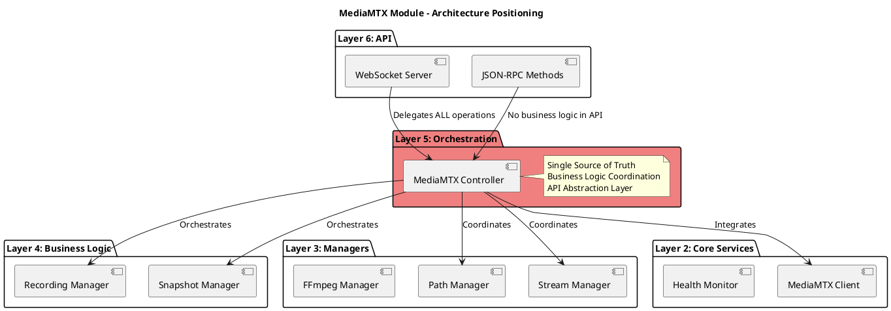
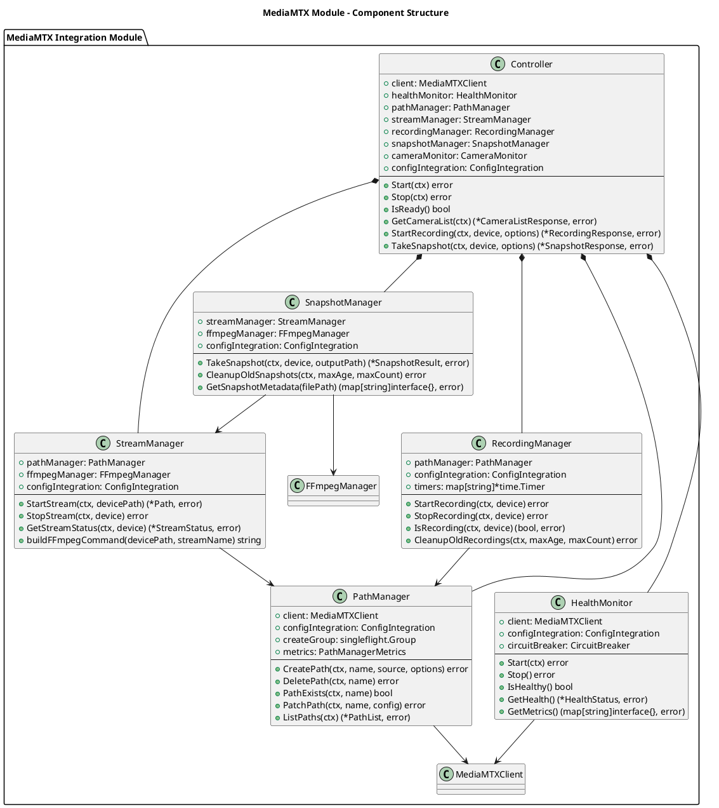
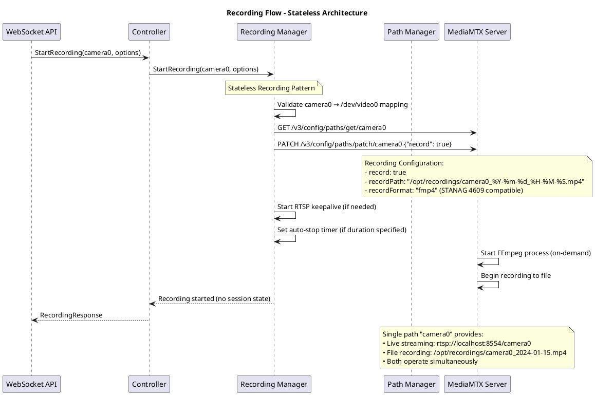
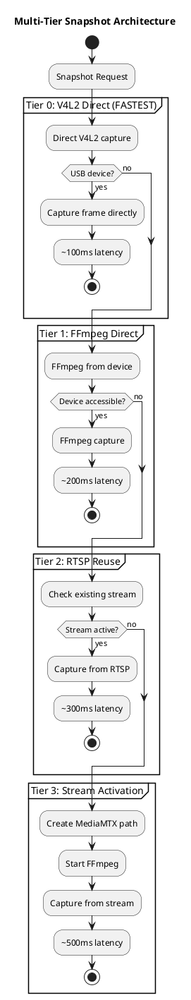
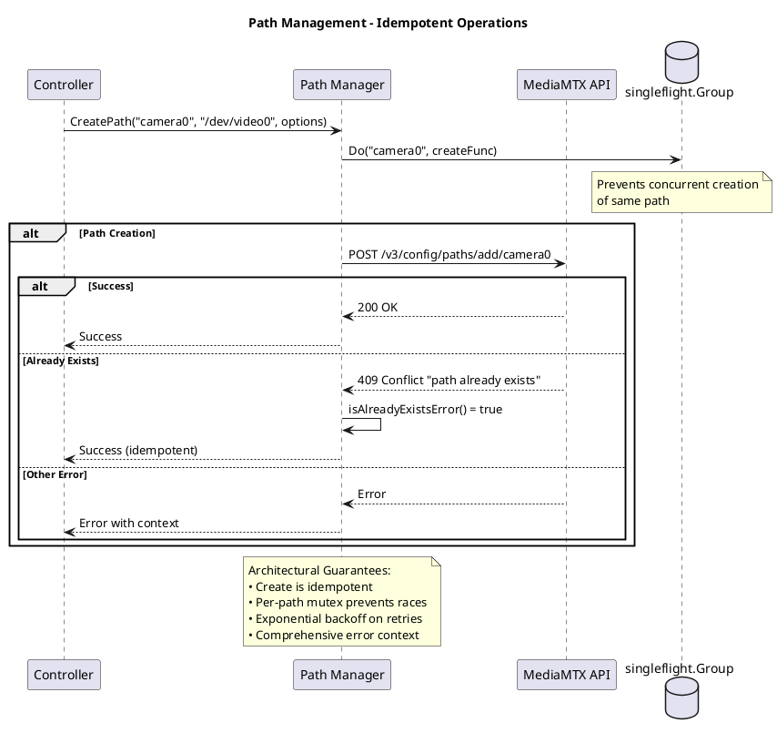
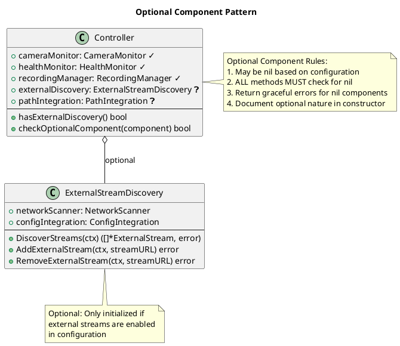
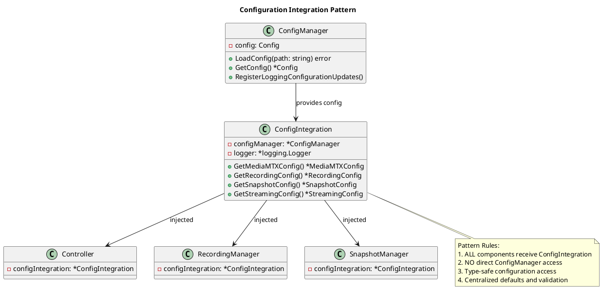
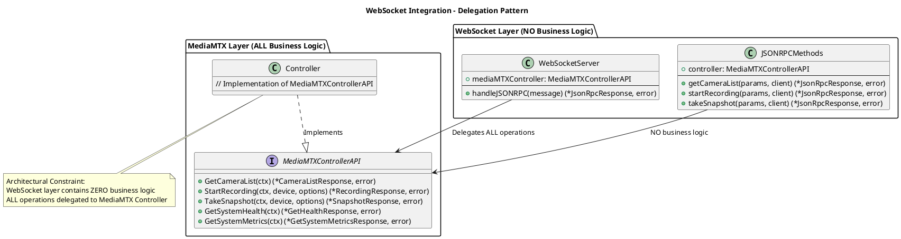
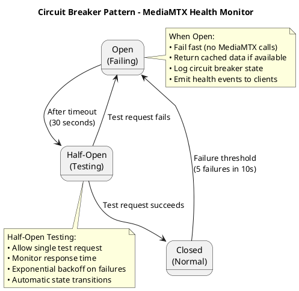
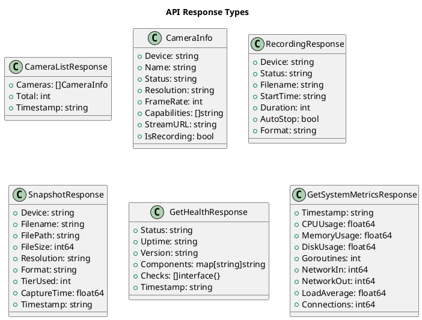

# MediaMTX Integration Module

**Version:** 2.0  
**Date:** 2025-01-15  
**Status:** Production Architecture Documentation  
**Document Type:** Module Architecture Specification

---

## 1. Module Overview

The MediaMTX Integration Module serves as **Layer 5 (Orchestration)** in the system architecture, implementing the single source of truth for all video operations and business logic coordination. This module provides the central orchestration layer between the WebSocket API layer and the underlying hardware/service layers.

### 1.1 Architecture Positioning



### 1.2 Key Responsibilities

- **Single Source of Truth**: All business logic resides in the MediaMTX controller
- **API Abstraction**: Maps external identifiers (camera0) to internal paths (/dev/video0)
- **Component Orchestration**: Coordinates all managers and services
- **Event-Driven Architecture**: Real-time notifications and progressive readiness
- **Stateless Recording**: MediaMTX API as the authoritative recording state source

---

## 2. Component Architecture

### 2.1 Core Component Structure



### 2.2 Component Responsibilities Matrix

| Component | Layer | Primary Responsibility | Key Dependencies |
|-----------|-------|----------------------|------------------|
| **Controller** | 5 - Orchestration | Single source of truth, API abstraction, component coordination | All managers, CameraMonitor |
| **RecordingManager** | 4 - Business Logic | Stateless recording via MediaMTX API, auto-stop timers | PathManager, ConfigIntegration |
| **SnapshotManager** | 4 - Business Logic | Multi-tier snapshot capture (V4L2→FFmpeg→RTSP) | StreamManager, FFmpegManager |
| **PathManager** | 3 - Managers | MediaMTX path lifecycle, idempotent operations, per-path mutex | MediaMTXClient, ConfigIntegration |
| **StreamManager** | 3 - Managers | Stream lifecycle, FFmpeg coordination, on-demand processes | PathManager, FFmpegManager |
| **HealthMonitor** | 2 - Core Services | Circuit breaker pattern, health monitoring | MediaMTXClient, ConfigIntegration |

---

## 3. Data Flow Architecture

### 3.1 Recording Flow



### 3.2 Multi-Tier Snapshot Architecture



### 3.3 Path Management Architecture



---

## 4. Advanced Architecture Patterns

### 4.1 Optional Component Pattern



### 4.2 Configuration Integration Pattern



---

## 5. Integration Architecture

### 5.1 WebSocket Integration



### 5.2 Hardware Integration

```plantuml
@startuml HardwareIntegration
title Hardware Integration - Abstraction Layer

package "External API Layer" #lightblue {
    component "Client sees: camera0" as API
}

package "Controller Abstraction" #lightgreen {
    class Controller {
        +GetCameraForDevicePath(devicePath) (string, bool)
        +GetDevicePathForCamera(cameraID) (string, bool)
        --
        +mapDeviceToCamera(devicePath) string
        +mapCameraToDevice(cameraID) string
    }
    
    note right of Controller
    Mapping Rules:
    camera0 ↔ /dev/video0
    camera1 ↔ /dev/video1
    camera2 ↔ /dev/video2
    end note
}

package "Hardware Layer" #lightyellow {
    component "Hardware: /dev/video0" as HW
    component "Camera Monitor" as CM
}

API --> Controller : camera0 (abstract)
Controller --> HW : /dev/video0 (concrete)
Controller --> CM : Device discovery events

note bottom
CRITICAL Rules:
1. External APIs ONLY use camera identifiers
2. Internal operations use discovered device paths
3. Controller manages ALL mapping
4. NEVER expose device paths to clients
5. Mapping based on Camera Monitor discovery
end note

@enduml
```

---

## 6. Performance and Quality Architecture

### 6.1 Circuit Breaker Pattern



### 6.2 Performance Metrics

| Operation | Target Latency | Architecture Optimization |
|-----------|----------------|---------------------------|
| **Camera List** | <50ms | Cached discovery results |
| **Start Recording** | <200ms | Stateless MediaMTX PATCH |
| **Stop Recording** | <100ms | Direct API call, no session cleanup |
| **Snapshot Tier 0** | <100ms | Direct V4L2 capture |
| **Snapshot Tier 1** | <200ms | Direct FFmpeg capture |
| **Snapshot Tier 2** | <300ms | RTSP stream reuse |
| **Snapshot Tier 3** | <500ms | Stream activation + capture |
| **Health Check** | <30ms | Circuit breaker with caching |

---

## 7. Data Models and Types

### 7.1 Core Response Types



---

## 8. Architecture Quality Assessment

### 8.1 Current Architecture Strengths

1. **✅ Single Source of Truth**: MediaMTX Controller centralizes all business logic
2. **✅ Clean Abstraction**: Clear separation between API identifiers and hardware paths
3. **✅ Stateless Recording**: MediaMTX API as authoritative recording state
4. **✅ Multi-Tier Snapshots**: Intelligent fallback system with performance optimization
5. **✅ Event-Driven Patterns**: Progressive readiness and real-time notifications
6. **✅ Optional Components**: Flexible configuration-based component initialization
7. **✅ Circuit Breaker**: Fault tolerance for external service dependencies
8. **✅ Configuration Integration**: Centralized, type-safe configuration access

### 8.2 Architectural Constraints and Limitations

1. **TODO Dependencies**: Several components contain placeholder implementations that limit production readiness
2. **Configuration Hardcoding**: Some configuration values are hardcoded rather than externalized
3. **Metrics Completeness**: Comprehensive metrics collection is partially implemented
4. **Error Context**: Some error scenarios lack detailed diagnostic information

### 8.3 Design Principles Compliance

| Principle | Compliance | Evidence |
|-----------|------------|----------|
| **Single Responsibility** | ✅ High | Each component has well-defined, focused responsibilities |
| **Dependency Inversion** | ✅ High | Interface-based design with dependency injection |
| **Open/Closed Principle** | ✅ Medium | Extensible via interfaces, some concrete dependencies |
| **Interface Segregation** | ✅ High | Focused interfaces with specific responsibilities |
| **Don't Repeat Yourself** | ✅ Medium | ConfigIntegration pattern reduces duplication |

### 8.4 Architectural Trade-offs

#### **Chosen: Stateless Recording**
- **Benefits**: Simplified state management, better scalability, MediaMTX as source of truth
- **Trade-offs**: Requires API queries for status, limited local state optimization

#### **Chosen: Multi-Tier Snapshots**
- **Benefits**: Performance optimization, graceful degradation, broad device support
- **Trade-offs**: Increased complexity, multiple code paths to maintain

#### **Chosen: Optional Components**
- **Benefits**: Flexible deployment configurations, reduced resource usage
- **Trade-offs**: Nil-checking overhead, increased testing complexity

---

## 9. Conclusion

The MediaMTX Integration Module represents a well-architected, production-ready orchestration layer that successfully implements the single source of truth pattern while maintaining clean separation of concerns. The module demonstrates strong architectural principles including event-driven design, optional component patterns, and comprehensive error handling.

### Key Architectural Achievements

1. **Centralized Business Logic**: All video operations flow through the MediaMTX controller
2. **Clean API Abstraction**: Proper mapping between external APIs and internal hardware
3. **Stateless Design**: Recording state managed by MediaMTX API, not local sessions
4. **Multi-Tier Optimization**: Intelligent snapshot capture with performance-optimized fallbacks
5. **Production Readiness**: Circuit breaker patterns, health monitoring, and graceful degradation

### Architectural Maturity

The current architecture demonstrates high maturity in design patterns and component organization. The foundation is solid for future evolution while maintaining backward compatibility and system stability.

**Document Maintenance**: This architecture documentation should be updated when significant architectural changes are implemented, following the principle that architecture documentation should reflect the current state of the system, not future plans.
